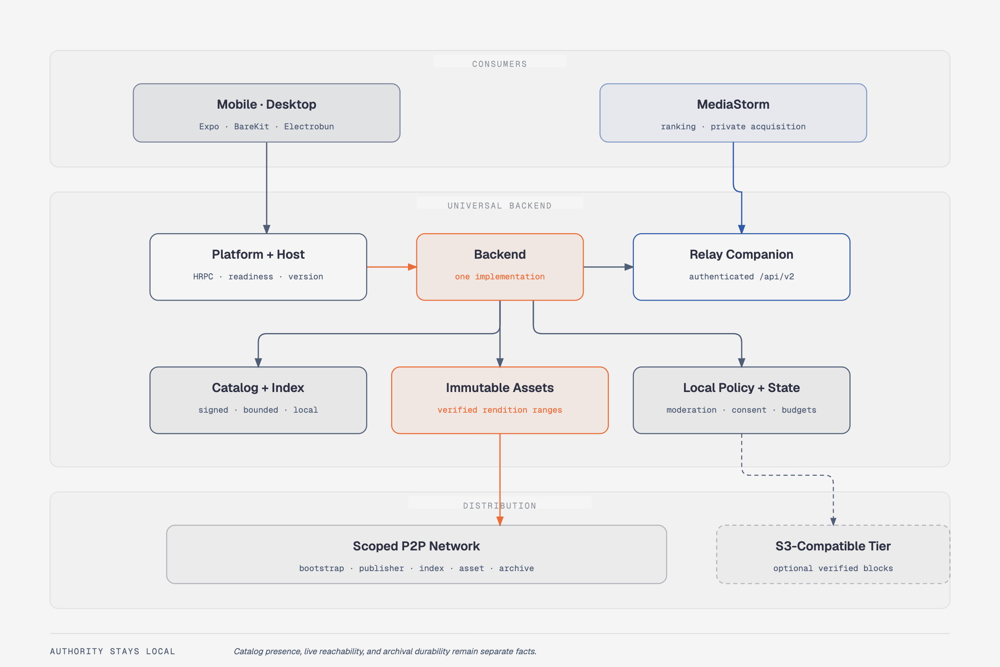

# PearTube

PearTube is a pre-alpha, permissionless media CDN, decentralized acquisition provider, and consumer streaming client built on the Hypercore stack. Mobile, Electrobun desktop, relay, and third-party clients use one universal backend contract. The authenticated machine API exposes the same `search -> resolve -> acquire -> verify -> stream -> retain` flow without naming or privileging a client or source adapter.



<sub>Source: [`docs/architecture.html`](docs/architecture.html) — self-contained, opens offline.</sub>

## Current State

| Surface | Status | Primary command |
| --- | --- | --- |
| iOS | Active development, Expo + BareKit | `npm run ios` |
| Android | Active development, Expo + BareKit | `npm run android` |
| Electrobun desktop | Main desktop shell, Expo web export + embedded `pear-runtime` worker | `npm run desktop` |
| Relay | CLI/container for provider search, acquisition, seeding, archive UI, and local mirror workflows | `docker compose -f docker-compose.relay.yml up -d` |

Pear OTA desktop release automation is not wired yet. Use the Electrobun build/release workflows in this repo; do not reintroduce `pear run` or claim OTA support without a dedicated release-flow change.

## Product Vision

- One moderated consumer catalog assembled from signed publisher records and bounded index feeds.
- Immutable rendition cores transferred and verified over purpose-scoped P2P sessions; no HTTP media-origin fallback.
- Client applications own ranking and source choice. PearTube owns bounded provider resolution, acquisition consent, exact verification, publisher-authorized publication, P2P delivery, retention, and archival evidence.
- Relays are voluntary discovery, acquisition, seed, and archive peers. They gain no global catalog, moderation, source credential, or publisher authority.
- Acquisition follows explicit local policy and uses separate `acquisition-discovery` and per-assignment `acquisition` scopes. Archive custody remains a later, separate action.
- Participation is explicit policy: watch-only, balanced contribution, or archive-enabled, with metered, battery, thermal, storage, and upload limits.
- Watch history, library state, and recommendations remain local. PearTube sends no viewer analytics.
- Cloud block offload has one supported path: S3-compatible object storage. No second cloud offload provider is part of the contract.

## Architecture

Every client boots or connects to the same backend contract:

```text
Client shell
  -> platform runner
  -> @peartube/host
  -> @peartube/backend
  -> Corestore / Autobase / Hyperbee / Hyperblobs / Hyperswarm
```

| Client | UI shell | Backend runner | RPC |
| --- | --- | --- | --- |
| iOS / Android | Expo + React Native | BareKit worklet | HRPC over BareKit IPC |
| Electrobun desktop | Expo web export | embedded `pear-runtime` worker | HRPC over worker pipe |
| Relay | CLI / container | direct backend runtime | local process API |

## Packages

| Package | Responsibility |
| --- | --- |
| `packages/app` | Expo app, mobile routes, Electrobun export, mobile BareKit backend bundle, desktop worker bundle |
| `packages/core` | Shared app components, hooks, stores, and types |
| `packages/platform` | App-side runner selection and RPC facade |
| `packages/host` | Backend lifecycle wrapper, host errors, shared `PROTOCOL_VERSION`, and the universal protocol client (readiness normalization, event map, grouped namespaces) |
| `packages/backend` | Provider service, acquisition state and policy, signed publisher catalogs, local/federated indexes, immutable assets, scoped networking, playback, S3 block offload, and diagnostics |
| `packages/spec` | HRPC schema source and JS code generation |
| `packages/cli` | Relay CLI/container, authenticated provider machine API, archive UI, acquisition jobs, and local mirror support |
| `packages/bare-*` | Vendored/native Bare runtime support, including `bare-ffmpeg` |

## Prerequisites

- Node.js from `.nvmrc` (`20.18.0`) or another supported version from `package.json` (`>=18 <23`).
- Git submodules, currently `packages/bare-ffmpeg`.
- iOS: Xcode, CocoaPods, and the iOS simulator/toolchain.
- Android: Android Studio, Android SDK, and JDK 17.
- Electrobun desktop: Bun and the Electrobun toolchain.
- Relay/container workflows: Docker with Compose.

## Fresh Clone

```bash
git clone <repo-url>
cd peartube
nvm use
git submodule update --init --recursive
npm run install:all
npm run schema:full
npm run bundle:backend
```

`npm run install:all` is the repository install contract and is what CI uses. The repo currently uses plain npm installs across packages; the root `package-lock.json` is local/ignored, while `packages/app/package-lock.json` is tracked. Treat fully locked dependency installs as a separate policy decision.

## Run Locally

```bash
npm start                  # Expo dev server
npm run ios                # iOS simulator
npm run android            # Android emulator/device
npm run desktop            # Build and launch Electrobun desktop
npm run desktop:build      # Build Electrobun web/worker assets only
npm run desktop:start      # Launch the built Electrobun app
```

## Relay

Run the packaged relay container:

```bash
docker compose -f docker-compose.relay.yml up -d
docker compose -f docker-compose.relay.yml exec relay /peartube-relay status --json
```

The default compose file exposes the archive UI at `http://127.0.0.1:8174` and persists relay storage in the `peartube-relay-data` volume.

Archive a video from the container:

```bash
docker compose -f docker-compose.relay.yml exec relay \
  /peartube-relay archive --url https://youtu.be/... --channel-name "Anonymous Archive" --run-now
```

Use `docker-compose.local-relay.yml` when you want the relay to mirror a local host directory into PearTube.

## Generated Code

`packages/spec/schema.cjs` is the HRPC schema source of truth. After changing the schema, run:

```bash
npm run schema:full
npm test --prefix packages/spec
```

`schema:full` regenerates JS schema/HRPC output. Generated app-facing metadata lives at `packages/spec/spec/hrpc/app-rpc-adapter.mjs`.

## Verification

Use the narrowest command that covers the change:

```bash
npm run typecheck
npm test
npm run lint:changed
npm test --prefix packages/backend
npm test --prefix packages/host
npm test --prefix packages/spec
npm run desktop:build
npm run desktop:smoke --prefix packages/app
```

CI has separate workflows for fast tests, Android/mobile builds, Electrobun desktop, relay builds, and release artifacts.

## Development Docs

- [QUICKSTART.md](./QUICKSTART.md) - shortest fresh-clone runbook.
- [SETUP.md](./SETUP.md) - platform-specific setup and troubleshooting.
- [DEVELOPMENT.md](./DEVELOPMENT.md) - daily commands and generated-artifact workflow.
- [ARCHITECTURE.md](./ARCHITECTURE.md) - live architecture overview.
- [docs/diagrams/](./docs/diagrams/) - code-traced backend diagrams.

Project history, design decisions, open correctness findings, and platform
knowledge live on the PearTube page in the Obsidian vault, not in this tree.

## Storage

Clients resolve storage paths through `@peartube/platform` and the active runner.

## License

Apache-2.0
