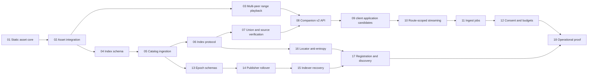

# PearTube Distributed Archive Phase 1 Implementation Roadmap

**Approved specification:** `docs/superpowers/specs/2026-08-09-distributed-archive-search-scale-design.md`

**Goal:** Ship the client application companion path on a permissionless, independently indexed, exact-byte P2P archive substrate without making ordinary companions replicate the global catalog.

**Architecture:** Publisher-owned Autobase/Hyperbee catalogs remain authoritative. Independent HyperDB index services derive searchable projections, companions verify the selected result against its current publisher source, and immutable static-prologue Hypercores deliver exact bytes from one or more peers. client application remains the ranking and playback authority across all providers.

**Tech stack:** JavaScript ESM, Bare/Node, Hypercore 11, Hyperbee 2, HyperDB 6, Autobase 7, Hyperswarm 4, Protomux 3, compact-encoding, Brittle, Go, client application's existing debrid/playback pipeline.

## Global constraints

- `@peartube/backend` remains the only P2P backend implementation.
- Add backend-facing HRPC fields to `packages/spec/schema.cjs` first and run `npm run schema:full`.
- `@peartube/host` remains the sole owner of `PROTOCOL_VERSION`.
- The DHT stores connectivity metadata only; never catalog records, titles, claims, manifests, or search results.
- Exact media uses canonical 256 KiB blocks plus one final short block.
- Byte-identical imports must produce the same static core key, asset ID, and asset topic.
- Watch-only is the default and uploads zero asset bytes.
- Contribution cache and archive pins require distinct explicit consent and budgets.
- Private tracker IDs, passkeys, debrid credentials, cookies, signed URLs, and request headers never enter public records or durable companion job state.
- PearTube remains an optional client application provider; failure never delays or blocks other providers.
- Provider-neutral external references remain separate claims; TMDB is not the owner of work identity.
- No backend/index protocol may assume client application is the only client or companion publishers are permanent pseudonyms.
- Multi-file torrent/pack provenance is metadata-only; each playable file retains an independent asset/core/swarm.
- Use failing-first focused tests for each plan. Run project-wide suites only after Plan 18.
- Clean cutover: update every caller and fixture; leave no compatibility alias unless the approved spec explicitly requires a migration input.

## Dependency graph

## Plans

| # | Plan | Independently testable output | Depends on |
|---|---|---|---|
| 01 | [Deterministic static asset core](2026-08-09-01-static-asset-core.md) | Two stores derive one read-only core identity from identical bytes | — |
| 02 | [Asset manifest and ingestion cutover](2026-08-09-02-asset-manifest-ingestion.md) | Uploads publish v2 descriptors and quarantine ambiguous legacy assets | 01 |
| 03 | [Verified multi-peer range playback](2026-08-09-03-multi-peer-range-playback.md) | Sparse ranges are fetched and verified across peer churn | 02 |
| 04 | [Durable index schema](2026-08-09-04-index-schema.md) | HyperDB persists normalized source and projection rows within budgets | 02 |
| 05 | [Incremental publisher ingestion](2026-08-09-05-catalog-ingestion.md) | Pinned Hyperbee checkout diffs update one publisher transactionally | 04 |
| 06 | [Index service protocol](2026-08-09-06-index-service-protocol.md) | Signed service discovery and bounded Protomux queries work directly | 05 |
| 07 | [Multi-index union and verification](2026-08-09-07-index-union-verification.md) | URL-less candidates are deduplicated and current-source verified | 06 |
| 08 | [Companion v2 API](2026-08-09-08-companion-v2-api.md) | Authenticated search/open/status/job routes expose the universal backend | 03, 07 |
| 09 | [client application candidate resolver](2026-08-09-09-client-candidate-resolver.md) | client application ranks `ServiceTypePearTube` before deferred resolution | 08 |
| 10 | [Route-scoped streaming](2026-08-09-10-route-scoped-streaming.md) | GET/HEAD ranges require short-lived route capabilities | 09 |
| 11 | [Durable ingest jobs](2026-08-09-11-ingest-jobs.md) | Completed spool and resumable source-capability ingest are idempotent | 10 |
| 12 | [Consent, retention, and status](2026-08-09-12-consent-retention-status.md) | Legacy installs fail to watch-only and contribution stays explicitly gated | 11 |
| 13 | [Catalog epoch schemas](2026-08-09-13-catalog-epoch-schemas.md) | Root-authorized seals/checkpoints encode complete replay state | 05 |
| 14 | [Publisher catalog rollover](2026-08-09-14-publisher-rollover.md) | A publisher crosses the 4,096-operation bound without identity change | 13 |
| 15 | [Indexer restart and repair](2026-08-09-15-indexer-recovery.md) | Cold/warm indexers converge from durable cursors and bounded checkpoints | 14 |
| 16 | [Locator anti-entropy](2026-08-09-16-locator-anti-entropy.md) | Signed locator/index announcements converge with expiry and equivocation rules | 06 |
| 17 | [Registration and discovery](2026-08-09-17-registration-discovery.md) | New publishers register with multiple indexers and new companions find them | 15, 16 |
| 18 | [Operational proof](2026-08-09-18-operational-proof.md) | Multi-process tests prove discovery, churn, partition healing, limits, and client application fallback | 12, 17 |

## Execution contract

1. Execute plans in numeric dependency order. Plans with satisfied dependencies may run concurrently.
2. Each plan ends with its focused tests and a smoke test of the changed runtime path.
3. A worker report is a claim: inspect its diff and verification output before accepting it.
4. Bugs, security failures, and blockers discovered during execution are fixed in the active plan. Architectural deviations stop for user review.
5. Each accepted task gets the outcome-focused commit listed in its plan. Do not mix unrelated cleanup or collapse distinct task boundaries.
6. Plan 18 runs the full monorepo and client application verification matrix after all focused checks pass.

## Final Phase 1 proof

Phase 1 is complete only when a fresh watch-only client application companion discovers multiple independent indexers, finds a publication without preloading the catalog, verifies the current publisher source, streams exact sparse ranges from multiple peers, falls through normally when PearTube is unavailable, and publishes no watch-derived record or byte until explicit contribution consent is enabled.