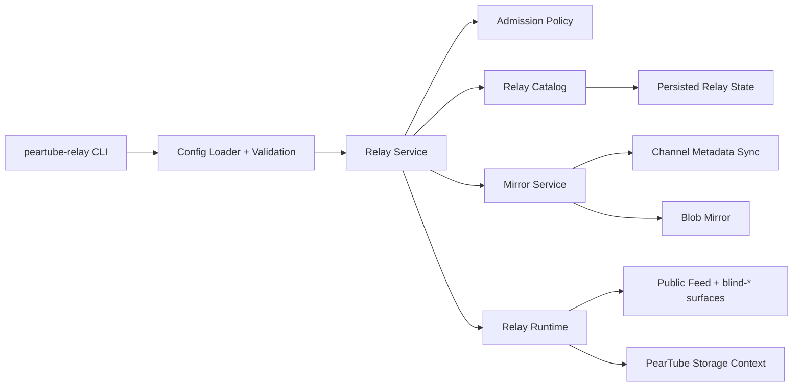

# PearTube Relay CLI Architecture

Date: 2026-03-28
Status: Proposed
Owner: Codex + user

## Goal

Refine the existing PearTube CLI into a relay-oriented service that operators can run on any system, especially through Docker, to provide:

- private high-availability for their own content
- public mirroring capacity for the wider PearTube network

The relay should be a thin operator-facing wrapper around Holepunch blind-peer style availability primitives plus PearTube's existing channel, metadata, and blob replication logic.

## Hard Constraints

- Expose two first-class modes: `private` and `public`.
- Keep `v1` focused on availability, not payments or marketplace mechanics.
- Support both channel-level and owner-level admission rules.
- In `v1`, accepted channels are mirrored fully, not partially.
- Preserve a simple operator model that works well in Docker and CI/CD.
- Avoid turning the relay into a full headless PearTube app with unrelated UI or upload responsibilities.

## Problem Statement

The current CLI in:

- `/Users/jd/projects/peartube/packages/cli/src/index.js`
- `/Users/jd/projects/peartube/packages/cli/src/init.js`
- `/Users/jd/projects/peartube/packages/cli/src/blob-downloader.js`
- `/Users/jd/projects/peartube/packages/cli/src/cache-manager.js`

is effectively a PearTube-aware caching peer. It bootstraps storage, joins the public feed, discovers channels, and downloads blobs into a quota-managed cache.

That is useful groundwork, but it is the wrong product boundary for the intended relay:

1. It centers on eager cache filling, not explicit relay policy.
2. It does not model `private` and `public` as separate service roles.
3. It does not expose a durable admission model for owners and channels.
4. It is not shaped as a container-first appliance with clean config, health, and release flows.

## Decision Summary

Introduce a dedicated relay service with a config-first operator contract and two primary modes:

- `private`: mirror only the operator's own configured owners and channels
- `public`: donate storage and bandwidth to the network through either discovery-driven or allowlist-driven admission

Keep the implementation thin by separating:

- policy and operator ergonomics in `@peartube/cli`
- replication/storage/network primitives in existing PearTube backend and Holepunch utility layers

For `v1`, all accepted channels are mirrored fully. Future paid relay reservations are explicitly out of scope, but the design should leave a clean extension point for reserved or contracted retention classes.

## Non-Goals

- Payment processing or marketplace matching.
- TURN-like generic relay infrastructure.
- Blob-level or per-video partial retention in `v1`.
- A public pricing or bidding protocol.
- Folding the relay into the desktop or mobile app runtime.
- Exposing low-level internal storage hooks as user-facing config.

## Why This Boundary

The current CLI code already proves that PearTube can:

- discover public channels
- load public metadata
- enumerate channel videos
- download referenced blobs
- enforce storage quotas

What it lacks is a clear service boundary.

The relay should not be "a cache peer with more flags." It should be "an availability appliance with explicit mode, policy, and retention semantics." That means:

- the CLI owns config, validation, admission, status, and packaging
- the relay runtime delegates actual replication and mirroring to the existing backend and Holepunch stack
- the product model remains understandable for operators and easy to ship as a Docker image

## Mode Model

### `private`

Purpose: make your own content highly available when you are offline.

Rules:

- admit only configured owner identities and/or channel keys
- do not opportunistically mirror unrelated public content
- reserve storage primarily for protected operator-owned content
- fail loudly if configured protected content cannot fit within protected storage constraints

Operator expectation:

"This relay exists for my channels or my organization's channels."

### `public`

Purpose: donate storage and bandwidth to the wider PearTube network.

Rules:

- can run in `allowlist` or `discovery` policy
- can mirror configured owners/channels and optionally discovered public channels
- uses explicit retention priority between protected and opportunistic content

Operator expectation:

"This relay helps the network and may also honor curated public allowlists."

## Policy Model

### `allowlist`

Accept only configured owners and channels.

Applies to:

- `private`
- `public`

### `discovery`

Accept discovered public channels until policy limits or storage pressure require rejection or eviction.

Applies to:

- `public`

`private` should not allow discovery admission.

## Admission Targets

The relay must support both:

- channel keys
- owner identity keys

Channel rules take effect immediately.

Owner rules expand lazily as owner metadata becomes known through normal replication and discovery flows. The relay should not assume the existence of a global owner index in `v1`.

## Target Architecture



## Package Responsibilities

### `packages/cli`

Own the operator-facing relay service:

- CLI commands
- config loading and validation
- admission policy
- relay catalog persistence
- quota policy
- status and health output
- Docker entrypoint ergonomics

### `packages/backend`

Continue to own PearTube's replication and data model primitives:

- storage initialization
- public feed discovery
- public bee loading
- blob replication and download primitives
- swarm lifecycle and metadata persistence

### Holepunch blind utilities

Use Holepunch blind-peer style utilities as the availability substrate where appropriate, but keep them behind the relay runtime boundary. The operator contract should describe relay behavior, not blind-peer internals.

The relay should provide content availability, not generic TURN-like relaying. `blind-relay` style infrastructure is out of scope for this design.

## Proposed Internal Runtime Split

Refactor `packages/cli` into focused modules:

- `config`: parse CLI flags, YAML, and env overrides
- `service`: top-level lifecycle for `run`, `validate`, `status`, and shutdown
- `runtime`: join feed topics, initialize blind-peer surfaces, expose candidate channel events
- `admission`: evaluate owner/channel acceptance rules
- `catalog`: persist accepted channels, owners, retention class, last mirror status, and byte usage
- `mirror`: perform full metadata and blob mirroring for accepted channels
- `status`: produce human-readable and machine-readable health output

This keeps `startPeer()` from remaining the center of the product. The new center becomes a relay service that consumes runtime events and applies operator policy.

## CLI Contract

Canonical executable:

- `peartube-relay`

Compatibility alias:

- `peartube-peer`

Primary commands:

- `peartube-relay run`
- `peartube-relay init`
- `peartube-relay validate`
- `peartube-relay status`

Recommended invocation examples:

- `peartube-relay run --mode private`
- `peartube-relay run --mode public --policy discovery`
- `peartube-relay run --mode public --policy allowlist`

## Config Contract

The relay should be config-first. CLI flags may override config, and environment variables should override both for container deployment.

Example:

```yaml
mode: public
policy: allowlist

storage:
  path: /var/lib/peartube-relay
  maxBytes: 500000000000

admission:
  channels: []
  owners: []

discovery:
  enabled: false
  maxChannels: 500
  maxChannelsPerOwner: 20

retention:
  protectPrivate: true
  protectAllowlist: true

network:
  announce: true
  bootstrap: default

logging:
  level: info
```

Environment variable examples:

- `PEARTUBE_MODE`
- `PEARTUBE_POLICY`
- `PEARTUBE_STORAGE_PATH`
- `PEARTUBE_STORAGE_MAX_BYTES`
- `PEARTUBE_ADMISSION_CHANNELS`
- `PEARTUBE_ADMISSION_OWNERS`

Important rule: config describes operator policy only. It must not leak low-level internal constructs like public feed handlers, wakeup session internals, or blob downloader function names.

## Admission And Mirroring Flow

1. Relay starts and loads config and persisted catalog state.
2. Runtime initializes storage, joins the public feed, and activates blind-peer availability surfaces.
3. Every candidate channel is normalized into a record:
   - `channelKey`
   - `ownerKey` when known
   - `source=config|discovered`
   - `mode=private|public`
4. Admission evaluates the record:
   - `private`: accept only configured owners/channels
   - `public + allowlist`: accept only configured owners/channels
   - `public + discovery`: accept only if discovery policy and quota guardrails allow it
5. Accepted records are persisted in the relay catalog.
6. Mirror service performs a full mirror:
   - load channel metadata
   - resolve public bee metadata
   - enumerate videos
   - download and retain all referenced blobs
   - keep replicated state available so thin clients can read when the original publisher is offline
7. Periodic reconciliation verifies that accepted channels remain mirrored and up to date.

## Mirroring Model

`v1` uses full-channel mirroring.

For every accepted channel, persist:

- channel metadata
- video metadata
- all referenced video blobs
- other channel-serving data needed by thin clients

Do not attempt partial blob retention in `v1`. Partial retention makes operator reasoning, status output, and eviction semantics much harder to trust.

## Quota And Retention

Retention priority should be explicit:

1. `private` content
2. `public` allowlist content
3. `public` discovery content

Eviction should happen at whole-channel granularity, not per-video or per-blob granularity.

Rules:

- protected `private` channels should not be evicted automatically unless the operator explicitly opts into that behavior
- protected allowlist channels should outrank discovery-admitted channels
- discovery-admitted channels are the first eviction candidates under pressure
- if the relay cannot satisfy its protected retention promises, it should fail loudly in startup validation and status output rather than silently dropping content

## Status And Observability

`peartube-relay status` should report:

- mode and policy
- configured owners and channels
- accepted mirrored channels
- bytes used and bytes limit
- peer count and active connections
- last successful mirror timestamp per channel
- current protected versus evictable content summary
- current eviction candidates

Logging should explain:

- why a channel was accepted or rejected
- whether acceptance came from owner, channel, or discovery rules
- why a channel was evicted
- whether a mirror is stale, failed, or still in progress

For container environments, add a small machine-readable surface:

- local JSON status file and/or
- local HTTP health/status endpoint

## Docker Shape

Ship a dedicated relay image, not the full PearTube app image.

Defaults:

- storage volume: `/var/lib/peartube-relay`
- config path: `/etc/peartube-relay/config.yml`
- entrypoint: `peartube-relay run --config /etc/peartube-relay/config.yml`

The image should support:

- config-file startup for normal operators
- environment-only startup for quick demos and simple hosting platforms

Release collateral should include:

- sample config
- minimal `docker-compose.yml`
- quick-start README snippet

## CI/CD

Add relay-focused automation:

1. Test workflow coverage for `packages/cli`
2. Docker build workflow for the relay image
3. Multi-arch publish workflow to GHCR on tags and `workflow_dispatch`

Initial image targets:

- `linux/amd64`
- `linux/arm64`

The release flow should publish:

- versioned container image tags
- sample operator config
- compose example

## Migration Plan

1. Keep `peartube-peer` as a compatibility alias.
2. Introduce `peartube-relay` as the canonical executable.
3. Move existing cache-oriented logic behind the new `mirror` and `catalog` layers.
4. Replace ad hoc startup flags with validated mode and policy configuration.
5. Add status output and Docker packaging before calling the relay production-ready.

## Future Extension Path

Future "pay someone to mirror my content" support should build on the same admission model, not replace it.

The natural extension is a reserved retention tier:

- reserved owner
- reserved channel
- reserved quota slice

`v1` intentionally stops before payments, offers, escrow, or reputation mechanics. Manual whitelisting remains the only reservation path for the first release.

## Open Questions Deferred

- how aggressively owner metadata should be backfilled when owner rules are configured
- whether blind-peering version changes require adapter work before relay release
- whether the status surface should start as local JSON only or include an HTTP endpoint in the first cut

## Decision

Build a dedicated `peartube-relay` service with:

- first-class `private` and `public` modes
- `allowlist` and `discovery` public policy support
- channel and owner admission rules
- full-channel mirroring in `v1`
- container-first packaging and GHCR publishing

This keeps the relay easy to operate, aligned with the Holepunch availability model, and extensible toward future reserved relay offerings without dragging payment or marketplace scope into the first release.
