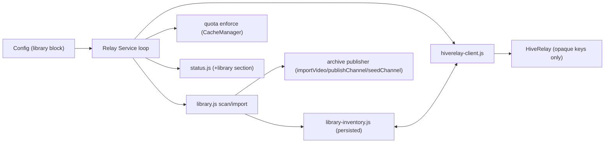

# PearTube Seeder (Publisher Agent) Specification

Date: 2026-07-24
Status: Phases 1–3 implemented (local — not yet committed); Phase 4 deferred
Owner: user + Claude
Supersedes nothing; extends: `2026-03-28-peartube-relay-design.md`
Design rationale: `docs/HOME-MEDIA-HIVERELAY-SEEDING-OPTIONS.md` (v0.2 synthesis — options ratified there; this spec is the implementable contract for the A′ composite)

## Goal

Extend the existing `peartube-relay` service into a **publisher agent** that turns operator-selected media folders into PearTube channels and delegates always-on availability to a co-installed HiveRelay (Blindspark) through its shipped seed-request API — on home appliances (TrueNAS, Umbrel, StartOS, Unraid) and plain Docker hosts.

One sentence boundary (audit dimension 1): *a publisher agent that imports opted-in folders as PearTube channels, keeps a persisted inventory with per-folder audience modes, and hands opaque drive keys to HiveRelay for durability.*

## Hard Constraints

1. **Zero HiveRelay changes.** The agent is PearTube client code. It talks to the relay only through the generic publisher-signed seed-request surface (`hiverelay.seed-request.v3`). No namespaces, endpoints, keys, or allowlist entries are added relay-side by this feature. (HiveRelay adoption contract.)
2. **Real modes only.** Audience is expressed with the existing `private | public` relay modes plus a per-folder `audience` override. No `home`/`friends` mode strings (config validation rejects them; friends is deferred).
3. **Ship gates.** Unseed (§9) and quota enforcement (§10) must exist with passing tests before any release that can publish publicly. These are currently unimplemented (findings PT-SEED-003/004).
4. **Persisted state.** Import idempotence and inventory survive process restarts (today's mirror state is in-memory only).
5. **Feature-detect and degrade.** No HiveRelay present → agent still publishes and self-seeds, inventory marks items `durability: self-only`. Relay upgrades never break the agent; agent upgrades never require relay upgrades.
6. **One swap point for the blind future.** All relay-facing calls live in one module so the seed-request path can be replaced by blind `CORE.MIRROR` later without touching config, CLI, or inventory semantics.
7. **Originals are sacred.** Media mounts are read-only; no agent operation ever deletes or rewrites a library file.
8. **Reuse the relay service skeleton.** This is an evolution of `@peartube/cli` (`peartube-relay`), not a new daemon class — respecting the ecosystem's deprecation of standalone durability sidecars.

## Non-Goals

- Friends/invite read-capability sharing (v1.1+, aligned with blind-substrate capability model — do not hand-roll interim crypto).
- Transcoding or derivative generation (originals-only v1; clients label playability honestly).
- Jellyfin/Plex API integration (folder mounts and watch folders only).
- Payments, bounties, or seeding-economics dependencies (HiveRelay's are deferred too).
- LAN-only operation claims (PearTube LAN discovery is unbuilt; pairing requires internet DHT in v1).
- Blind-daemon (`CORE`/`CELL`) integration now (`0.0.0-draft.1` — swap point reserved, dependency not taken).

## Component Decision

Extend `@peartube/cli` in place. The current `archive.localMirror` block (one path → one channel, coupled to the archive subsystem, wired in `service.js` `runLocalMirrorOnce`) is promoted to a first-class **library** subsystem; the archive alias remains working but deprecated.

New/changed modules inside `packages/cli/src/`:

| Module | Responsibility | Builds on |
|--------|----------------|-----------|
| `library.js` | Multi-folder scan/import orchestration with per-folder audience; scheduling (poll now, fs-events later) | `local-drive-mirror.js` (scan, fingerprint, yt-dlp sidecar, per-creator grouping — unchanged) |
| `library-inventory.js` | Persisted fingerprint + published-item DB; the single source of truth for "what is seeded, where, for whom" | new; persists under `storage.path` |
| `hiverelay-client.js` | Seed-request integration: detect relay, sign + submit, poll durable status, withdraw, spot-verify | `p2p-hiverelay-client` SDK (decided — see Open Questions; minimal in-repo client remains the documented fallback if the npm pipeline regresses) |
| `unseed.js` | Orchestrated removal (§9) | catalog, inventory, hiverelay-client, backend seeding |
| service loop | Wire `CacheManager.enforceQuota` into reconcile; add library + durability reconciliation | `service.js`, `cache-manager.js` (`enforceQuota` exists, currently uncalled) |
| `status.js` | Extend status JSON with `library` section (§11) | existing `buildRelayStatus` |



## Config Contract

Config-first, flags override config, env overrides both (existing rule). New top-level `library` block:

```yaml
mode: private            # private | public — global default audience posture
policy: allowlist

storage:
  path: /var/lib/peartube-relay
  maxBytes: 500000000000

library:
  enabled: false          # master toggle — default OFF
  pollSeconds: 300
  folders:
    - path: /media/PublicMovies   # read-only mount
      recursive: true
      audience: public            # public requires confirmed=true (below) or CLI confirm
      confirmed: false            # set true only by explicit operator action; never by default
      channelName: null           # optional; default = per-creator grouping / folder name
      maxFiles: 5000
    - path: /media/Family
      recursive: true
      audience: private
  caps:
    maxBytes: 500000000000        # library share of storage; imports pause at cap (fail loudly)
    maxConcurrentImports: 2
    maxBandwidthMbps: 25          # HomeHive-aligned default

hiverelay:
  enabled: true
  endpoint: auto          # auto = probe localhost + mDNS _hiverelay._tcp.local; or explicit URL/key
  seedRequest:
    durability: 1         # archive class
    ttlSeconds: 2592000   # renewed by reconcile loop before expiry
    revocable: true
  verifyIntervalHours: 24 # spot verifySeeded() probes

trust:
  durableRelayKeys: []    # local HiveRelay swarm key, injected at first-run pairing
```

Validation rules (extend `config.js`):

- `library.folders[].audience` ∈ {`private`, `public`}; anything else throws.
- `audience: public` with `confirmed: false` → folder is scanned but **not imported**; status reports `awaiting-public-confirmation`. Confirmation is `peartube-relay library confirm <path>` or editing `confirmed: true` by hand — never a default, never implied by global `mode`.
- Folder paths must exist and be readable at startup; missing paths fail validation loudly (matches relay "fail loudly" retention philosophy).
- `archive.localMirror.*` maps onto a synthesized single `library.folders[]` entry (audience follows global `mode`) with a deprecation warning.

Env additions: `PEARTUBE_LIBRARY_ENABLED`, `PEARTUBE_LIBRARY_FOLDERS` (JSON), `PEARTUBE_HIVERELAY_ENDPOINT`, `PEARTUBE_TRUST_RELAY_KEYS`.

## CLI Contract

Binary stays `peartube-relay` (alias `peartube-seeder` may be added for packaging clarity). New subcommands:

```
peartube-relay library status [--json]        # inventory: per-item audience, durable state, bytes, errors
peartube-relay library scan [--now]           # trigger one scan cycle
peartube-relay library confirm <folderPath>   # typed confirmation gate for audience: public
peartube-relay library unseed <videoId|channelKey|folderPath> [--json]
peartube-relay library verify [--json]        # run verifySeeded() probes now, report per item
```

`run`, `init`, `validate`, `status` behave as today; `validate` covers the new block.

## Identity Model

Per-folder channel keys under the single operator identity (decision D5):

- Non-sidecar files in a folder → one channel per folder (name = `channelName` or folder basename), key derived/persisted via the existing publisher (`ensureAnonymousChannel` grouping for yt-dlp sidecar content is unchanged).
- Channel private keys live in the agent's identity dir under `storage.path`; the spec inherits the relay's storage layout. Backup guidance ships in the operator quickstart (losing identity orphans channels — known risk, documented, not mitigated in v1).
- Keys are process-side only, managed via CLI/RPC; never surfaced to any UI layer (brain decision: renderer delegates P2P control to backend).

## Inventory Contract (`library-inventory.js`)

Persisted at `<storage.path>/library-inventory.json` (v1: atomic-write JSON; revisit hyperbee if item counts demand). Schema per item:

```jsonc
{
  "fingerprint": "path:size:mtimeMs",     // same recipe as local-drive-mirror
  "path": "/media/PublicMovies/x.mp4",
  "videoId": "…", "channelKey": "…",
  "audience": "public",
  "state": "imported | published | durable | self-only | unseeding | unseeded | failed",
  "bytes": 123,
  "relay": { "key": "…", "requestId": "…", "ttlExpiresAt": 0, "lastVerifiedAt": 0, "lastVerifyOk": true },
  "publishedAt": 0, "updatedAt": 0,
  "lastError": null
}
```

Rules:

- The inventory — not process memory — answers "already imported?" on every scan (closes PT-SEED-008; restart must not re-import; add regression test).
- State transitions are append-logged at `info` so operators can reconstruct why an item is public/durable (relay logging philosophy: explain admissions and evictions).
- `unseeded` is terminal but retained (visible history); a re-appearing file with the same fingerprint stays unseeded until the operator re-adds it (no silent re-publish of something deliberately withdrawn).

## HiveRelay Integration (`hiverelay-client.js`)

Request mapping per published drive:

| Seed-request field | Value |
|---|---|
| `appKey` / `discoveryKeys` | drive key + blob core keys (opaque to relay) |
| `type` | `media` |
| `durability` | `1` (archive) |
| `maxStorageBytes` | **actual measured drive size** (the API default of 500 MiB is too small for media — always set explicitly) |
| `ttlSeconds` | from config; reconcile loop renews before expiry |
| `revocable` | `true` (required for unseed) |
| `storageClass` / `availabilityClass` | `persistent` / `always-on` |

Flow:

1. **Detect** (startup + reconcile): probe `hiverelay.endpoint`; on `auto`, try localhost, then mDNS `_hiverelay._tcp.local`. Absent relay → items stay `self-only`; agent keeps seeding itself; status says so. No errors, no retry storms (backoff).
2. **Submit**: publisher-signed request per drive. Appliance accept-mode is `review` by default — the first request surfaces in the Blindspark dashboard for one-time operator approval; packaging docs instruct approving the agent's publisher key (allowlist) so later requests auto-accept. The agent treats `pending` as a normal long-lived state, not an error.
3. **Confirm**: poll `getDurableStatus()` / `waitForDurable()`; on durable, item state → `durable`, `relay.key` recorded, and (if the key is in `trust.durableRelayKeys`) offload eligibility follows the existing `trustedRelayKeys` path in `@peartube/backend`.
4. **Verify**: every `verifyIntervalHours`, spot-run `verifySeeded()` on a sample; failures flip `lastVerifyOk` and surface in status (availability must be observable, not asserted).
5. **Withdraw**: unseed path issues `unseedRequest` / `POST /api/v1/unseed` (§9).

Degradation ladder: no relay → `self-only`; relay without seed API (feature-detect fails) → `self-only` + status warning; relay pending approval → `pending-approval`. The agent never blocks imports on relay availability.

## Audience Semantics

- **private** (default): channel published, blobs seeded, **no public-feed announce** (no `SUBMIT_CHANNEL` on `peartube-network`). Reachable by the operator's paired devices (existing BlindPairing device flow) and anyone holding the channel key. Honest label: "My devices" — not "LAN-only".
- **public**: after per-folder confirmation, channel announced on the public feed; donated-relay copies possible network-wide.
- **Escalation** private → public: requires the `confirm` gate; re-announce happens on next reconcile; state log records the transition.
- **De-escalation** public → private: unannounce + withdraw relay seed request + stop seeding public copies locally. Document the honest limit: bytes already fetched by third parties are not recallable; de-escalation stops *availability*, it cannot undo *distribution*.

## Unseed (§ship-gate, closes PT-SEED-003)

`peartube-relay library unseed <target>` (and Phase 3 app RPC) performs, in order:

1. Mark inventory item(s) `unseeding` (crash-safe: reconcile resumes incomplete unseeds).
2. Withdraw relay custody: `unseedRequest` per registered request (skip if `self-only`).
3. Unannounce if public (remove from feed surfaces this agent controls).
4. Stop local seeding + clear the item's seeded blobs via the backend seeding manager (`removeSeed`/`clearSeedBlob` path).
5. Mark `unseeded`; originals untouched (assert: no fs writes under `/media` — enforced by read-only mounts and by never issuing unlink).

Whole-channel unseed = the above per video + channel unannounce. Test: full round-trip leaves originals byte-identical, inventory terminal, status consistent, and a fresh client can no longer fetch from this host or the local relay.

## Quota Enforcement (ship-gate, closes PT-SEED-004)

- Wire `CacheManager.enforceQuota()` into the service reconcile loop (it exists at `cache-manager.js` and currently has zero callers).
- Retention classes extend the relay design's priority order: **library-published content is protected** — never auto-evicted; when `library.caps.maxBytes` is reached, imports pause and status/logs fail loudly (mirrors "fail loudly if protected content won't fit"). **Donated capacity (public relay mirroring) is evictable**, whole-channel, discovery-admitted first — as the relay design already specifies.
- Tests: over-quota donated channel evicted; protected library content never evicted; import pauses at cap with loud status.

## Status & Observability (§11)

Extend `buildRelayStatus` with:

```jsonc
"library": {
  "enabled": true, "folders": 2,
  "items": { "total": 143, "durable": 120, "selfOnly": 20, "pendingApproval": 2, "failed": 1 },
  "bytes": 812000000000, "capBytes": 500000000000, "importsPaused": false,
  "awaitingPublicConfirmation": ["/media/PublicMovies"],
  "hiverelay": { "detected": true, "endpoint": "…", "lastVerifyAt": 0, "verifyFailures": 0 },
  "lastScan": { "at": 0, "scanned": 0, "imported": 0, "skipped": 0, "failed": 0 }
}
```

Every state named in the inventory contract is visible here; nothing durable is asserted without a verify timestamp backing it.

## Lifecycle

`close()` tears down, in order: scan timers, in-flight imports (cancellation point between files), hiverelay-client (abort polls), inventory flush, then the existing relay service close path. One lifecycle/failure-path test is mandatory (Mafintosh lens): kill mid-import → restart → no duplicate imports, no orphaned inventory states.

## Packaging & First-Run

- Reference install: umbrella `docker-compose` — `peartube-relay` (this agent) + `blindspark`, shared network, media mounted read-only into the agent only. Extends the existing `docker-compose.local-relay.yml` pattern.
- First-run bootstrap (documented, scriptable): (a) copy Blindspark's public key into agent `trust.durableRelayKeys` (and paired clients); (b) operator approves the agent's publisher key in Blindspark's review queue once.
- No store submissions gated: GHCR image + compose is the v1 distribution (per HR-AUDIT-001 lesson).
- **OTA trajectory:** the ecosystem goal is OTA updates for everything. HiveRelay's drive-boot appliance design (thin outer container + signed Hyperdrive code drive, `00-core/hiverelay/docs/DRIVE-BOOT-APPLIANCE.md`, not yet approved for build) and the live systemd-fleet updater (channels + health gate + rollback) are the patterns to align with. For this agent that means: keep the container thin and the JS updatable independently; never couple agent updates to relay updates; when the drive-boot pattern is ratified, the agent's code drive rides the same mechanism Blindspark uses.

## Test & Proof Plan

| Proof | Maps to |
|-------|---------|
| Restart-without-reimport (persisted inventory) | PT-SEED-008 |
| Config validation: audience values, unconfirmed-public not imported, missing paths fail loudly | PT-SEED-002 |
| Unseed round-trip (originals untouched, fetch fails after) | PT-SEED-003 / Spike S3 |
| Quota: donated evicted, protected paused-loudly | PT-SEED-004 / Spike S4 |
| **S2 integration**: seed request → review-approve → `waitForDurable` → stop agent → fresh client streams | PT-SEED-001/-005/-006 |
| Lifecycle: kill mid-import, clean resume | Mafintosh lens gate |
| Malformed yt-dlp sidecar fuzz (normalizeText path) | PT-SEED-010 |

## Phasing

- **Phase 1** (this spec's v1): library block, inventory, unseed, quota wiring, `self-only` operation, status. No HiveRelay required.
- **Phase 2**: `hiverelay-client.js` + compose packaging + first-run trust bootstrap (S2 proof is the exit).
- **Phase 3**: PearTube app pairing RPC for inventory/modes/unseed (schema additions to `packages/spec/schema.cjs`; deferred detail).
- **Phase 4**: friends read-capabilities, lazy transcode, blind `CORE.MIRROR` swap — all behind the reserved module boundary.

## Open Questions (carried from design v0.2)

1. Sparse vs full mirror for *donated* capacity on 10 GB HomeHive-class boxes (full-channel rule may be too heavy; likely answer: small `maxChannels` default).
2. ~~SDK vs minimal in-repo client~~ **Resolved 2026-07-24: take `p2p-hiverelay-client` as a dependency.** Precondition: the HiveRelay npm publish pipeline is fixed (HR-AUDIT-001 — npm `latest` currently stale vs manifests) so the package installs from the public registry at a current version. Hard rule: registry install only — never a monorepo path import (PI-AUDIT-004 portability trap). The minimal in-repo client stays documented as the fallback if the pipeline regresses; the `hiverelay-client.js` module boundary makes the swap cheap either way.
3. Multi-tenant NAS per-user identities (deferred until real demand).

## Decision

Evolve `peartube-relay` into the publisher agent specified here: `library` config block with per-folder audience and confirmation gates, persisted inventory, unseed and quota enforcement as ship gates, HiveRelay durability via the shipped seed-request API behind a single swappable module, and honest degradation to self-seeding when no relay is present.

## Implementation status (2026-07-24)

Phase 1 + the HiveRelay client are implemented in `packages/cli` and covered by 153 passing tests. A four-lens adversarial audit (privacy, lifecycle/seeding, state-machine, client/CLI boundary) was run and its findings applied:

- **YAML parser** — fixed a pre-existing bug: the bundled parser could not parse lists-of-objects (`- key: value` + sibling keys), which broke both `library.folders` and the documented `archive.sources`.
- **Privacy (Blocker)** — `unseed` now retracts public channels from the feed via `publicFeed.unpublishChannel`, so unseed is fail-closed for public content (was fail-open; the runtime would re-seed).
- **Catalog bytes (High)** — a no-op rescan no longer zeroes per-channel catalog bytes (was corrupting quota accounting); bytes are summed from the live inventory.
- **Atomic persistence (High)** — inventory writes are temp+rename; a corrupt/torn file is quarantined and startup uses a clean slate instead of crash-looping.
- **Durability honesty (High)** — the client no longer records `durable` on an empty/unknown 2xx; only explicit accept/pending tokens are trusted.
- **Detect recovery (High)** — `detect()` re-probes after a TTL, so a relay down at startup can recover mid-session.
- **Concurrency (Med)** — scan/reconcile/unseed serialize through a shared lock; withdrawn-then-modified files stay withdrawn; quota eviction skips 0-byte channels; partial-seed handle leaks and out-of-band confirmation erasure are fixed; `validate` redacts the auth token.

Verified-correct and deliberately left as-is: the import/announce privacy path (default-off, default-private, private wrapper never touches the feed) and the non-unref'd heartbeat timer (the relay's process keepalive, asserted by an existing test).

## Phase 2 — Appliance glue (implemented 2026-07-24)

Phase 1 plus the HiveRelay client were already complete. Phase 2 wires the agent into a co-installed HiveRelay and makes first-run trust scriptable:

- **Umbrella compose** (`docker-compose.library.yml`) — peartube-relay (agent, default private) + HiveRelay (Blindspark, accept-mode `review`) on a shared network, media mounted read-only into the agent only. The relay receives opaque core keys; it never sees the media mounts.
- **First-run trust bootstrap** (`scripts/library-bootstrap-trust.mjs`) — fetches the relay public key from `/.well-known/hiverelay.json` and injects it into the agent's `trust.durableRelayKeys`, then prints the one-time dashboard-approval instruction (the operator action the script cannot perform). Idempotent.
- **Operator quickstart** (`docs/SEEDER-QUICKSTART.md`) — end-to-end walkthrough: bring up → wire trust → scan → inventory states → public confirm → unseed → verify, plus the honest limits (private = paired devices not LAN-only; no relay = self-only; friends deferred).
- **S2 proof harness** (`packages/cli/test/s2-proof.test.mjs`) — the Phase 2 exit criterion exercised against a stateful mock relay in review mode: detect → seed-pending → approve → durable → unseed, plus the restart-survives-durability leg and the relay-down self-only/recover leg. 3 tests / 16 assertions.

## Phase 3 — App pairing RPC (implemented 2026-07-24)

The paired app now drives the publisher agent over HRPC. Schema additions in `packages/spec/schema.cjs` (message structs) and the generated `app-rpc-adapter`:

| Command | Maps to |
|---------|---------|
| `library-status` | `getLibraryStatus()` |
| `library-scan` | `libraryScanOnce()` |
| `library-confirm` | `inventory.confirmFolder(path)` (the public gate) |
| `library-unseed` | `libraryUnseed(target)` |
| `library-verify` | `libraryReconcile()` (verifySeeded probes) |

Classified under a new `library` app-RPC namespace (5 methods; adapter now exposes 113 app methods). Keys never surface to the renderer — the control surface carries only videoId/channelKey/path/target and summary counts, consistent with the *renderer delegates P2P control to backend* decision.

**Test status:** 157 CLI tests + library-agent-client tests passing (2026-07-28). Phase 4 (friends read-capabilities, lazy transcode, blind `CORE.MIRROR` swap) remains deliberately deferred behind the reserved module boundary.

### Phase 3 adapter completion (2026-07-28)

- **HTTP control plane** on the archive console: `GET /library/status`, `POST /library/{scan,confirm,unseed,verify}` so appliances and paired clients share one surface with the CLI.
- **App host client** `packages/backend/src/library-agent-client.js` + HRPC handlers `LibraryStatus|Scan|Confirm|Unseed|Verify` (enabled when `PEARTUBE_LIBRARY_AGENT_URL` points at the agent console).
- **Bin alias** `peartube-seeder` → same entry as `peartube-relay`.
