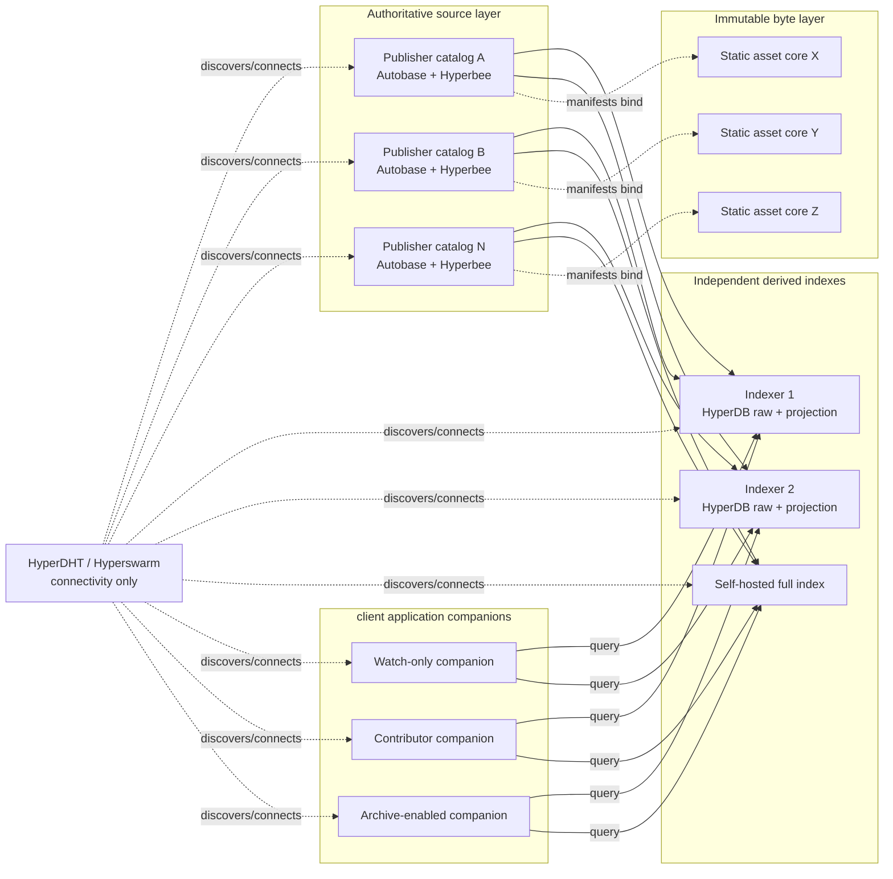
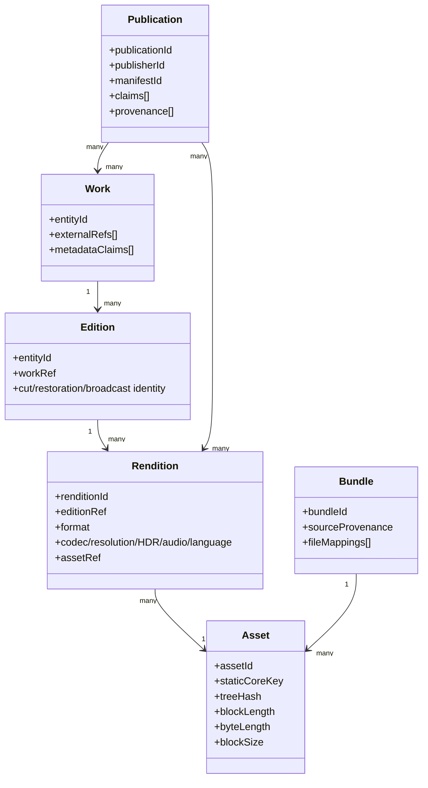
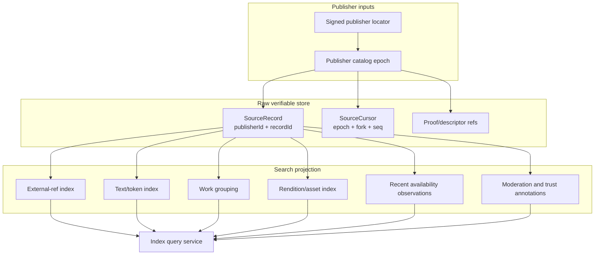
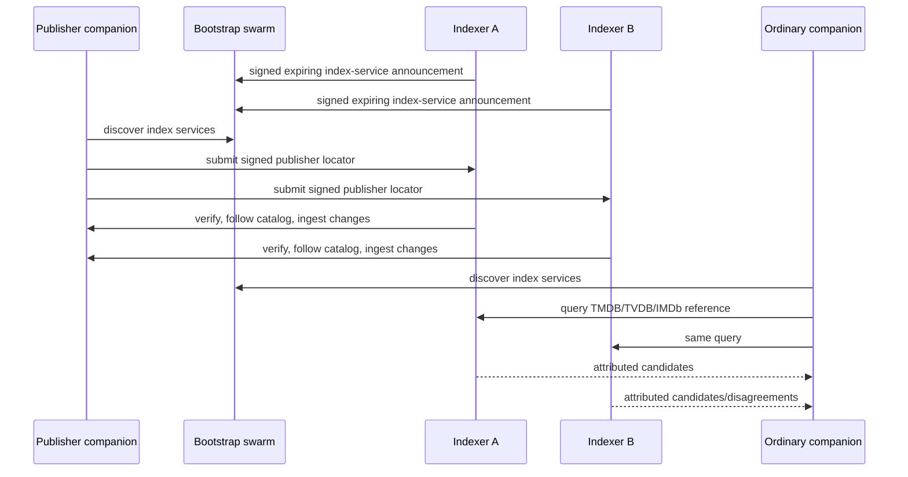
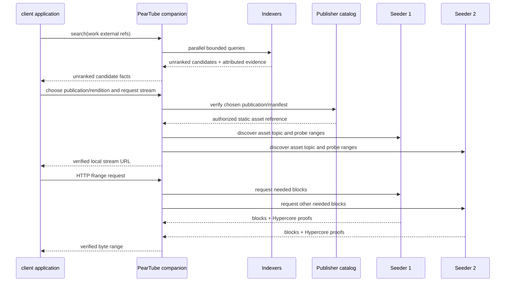

# PearTube Distributed Archive, Search, and Scale Design

**Date:** 2026-08-09  
**Status:** Approved by JD for implementation planning  
**Scope:** Permissionless archive substrate, generic client companion, independent indexing, asset delivery, watch-only/contributor roles, and the path to millions of records
**Related:** `docs/superpowers/plans/2026-07-23-permissionless-media-cdn.md`, `docs/superpowers/specs/2026-07-23-permissionless-media-cdn-design.md`

## 1. Executive decision

PearTube is not one globally mutable database.

It is the verifiable union of:

1. independently owned publisher catalogs containing signed source records;
2. immutable, exact-byte asset Hypercores;
3. independently operated search indexes derived from those catalogs;
4. live DHT discovery and direct peer connections for currently available bytes; and
5. local client policy that verifies, ranks, groups, and filters results.

The DHT stores no catalog, metadata, title, claim, manifest, or search result. It only helps peers connect.

The central scalability decision is **verifiable index federation**:

- Publishers remain the authoritative source of their own records.
- Any operator may run an indexer.
- Indexers ingest publisher catalogs into independently owned HyperDB views.
- Ordinary companions query several indexers and cache only what they use.
- High-storage operators may ingest the complete source corpus and serve a full index.
- Search results are references or provisional projections, never new publication authority.
- Before playback or republishing, the companion verifies the selected source against its publisher catalog and immutable asset descriptor.

This preserves permissionless publication without forcing every client application installation to replicate every record.

## 2. Product direction already settled

The following interview decisions are requirements, not open questions:

- Phase 1 is a PearTube companion process deployed beside each client application backend.
- client application TV, mobile, and desktop clients remain normal client application clients.
- The companion is **watch-only by default**: it downloads but does not announce or upload asset blocks.
- Serving watched media requires the explicit **Contribute watched media** opt-in.
- Permanent preservation is a separate explicit archive opt-in and storage budget.
- After contribution is enabled, newly acquired exact assets are registered and announced automatically.
- Auto-seed ingestion starts only after configurable evidence of meaningful watch intent; it never delays or reroutes active playback.
- client application resolves the primary TMDB/TVDB/IMDb context for companion ingestion.
- Torrent names and measured media facts corroborate or challenge that context; they do not silently replace it.
- Exact bytes define asset identity. Byte-identical imports must converge on one asset identity and one asset swarm.
- The user-facing hierarchy is `Work -> Edition -> Rendition -> Asset`.
- Playable files inside a season pack remain independent assets and swarms. Pack provenance is a metadata-only bundle mapping.
- PearTube returns an unranked set of candidates plus factual evidence. client application owns ranking and final selection.
- PearTube is one optional client application provider. Its absence or failure never blocks debrid, tracker, or other providers.
- Every companion can search the complete published catalog, even if it neither seeds media nor stores a complete local index.
- Indexers retain a raw verifiable layer and build a separate moderated/ranked projection.
- Phase 1 uses live/recent seeder evidence only. Long-term custody contracts and possession challenges are deferred.

## 3. The mental model

### 3.1 The “giant distributed data structure”



There is no single record that everybody may edit. There is no global consensus view of “Alien (1979).”

There are signed claims and publication manifests from many publishers. Every indexer deterministically extracts useful lookup keys from those records. Every client combines results according to its selected indexers, trust settings, and moderation policy.

### 3.2 Authority boundaries

| Layer | Owns | Does not own |
|---|---|---|
| Publisher catalog | Signed publication, claim, retraction, provenance, writer authorization | Global search order; another publisher’s record |
| Asset core | Exact immutable blocks and Merkle proof | Title identity; edition naming; availability promises |
| Indexer raw store | Verbatim accepted source records and source cursors | Publication authority |
| Indexer projection | Search keys, grouping, confidence, spam/moderation decisions | Ability to mutate or forge source records |
| DHT/Hyperswarm | Peer rendezvous and encrypted connections | Catalog data, metadata, search results |
| client application companion | Index selection, verification, local cache, availability probes | Universal ranking policy |
| client application | Cross-provider ranking and active playback choice | PearTube’s network protocol |

## 4. Core data structures

### 4.1 Publisher identity and catalogs

Reuse the current publisher system:

- stable `publisherId` derived from the publisher genesis root;
- authenticated writer admission and revocation;
- one bounded multi-writer Autobase catalog per active epoch;
- typed HyperDB projection for publications, claims, and retractions;
- signed namespace descriptors and catalog locators; and
- explicit protocol/capability advertisement.

A publisher catalog is an authoritative source feed, not a global title page.

```text
PublisherNamespace
  publisherId                 stable across every epoch
  activeRootKey               identity/policy authority
  catalogEpoch                monotonically increasing
  catalogBootstrapKey         active Autobase key
  previousCatalogEpoch        optional transition proof
  compatibility               protocol requirements

PublisherCatalogEpoch
  rawJournal[]                signed operations from admitted writers
  authorizationState          deterministic reduction
  publicationProjection[]     current accepted publication operations
  claimProjection[]           current accepted media claims
  retractionProjection[]      removals/supersessions
  rollover                    optional signed link to next epoch
```

### 4.2 Work, edition, rendition, and asset



Rules:

- **Work** is the provider-neutral identity layer. TMDB, TVDB, IMDb, and future IDs are signed equivalence claims to a work; no provider owns the work.
- **Edition** represents meaningful content differences: theatrical, director’s cut, uncensored, restoration, broadcast edit.
- **Rendition** represents technical presentation: container, codec, resolution, HDR, audio, language, subtitles.
- **Asset** is exact bytes. Any changed byte creates a different asset.
- **Publication** is one publisher’s attested binding of work/edition/rendition/asset plus provenance.
- **Bundle** preserves torrent/release/pack provenance but never forces a client to download or retain unrelated files.

The current `media-graph/entity-ref.js` provider-neutral ID derivation is retained. TMDB/TVDB/IMDb namespaces remain separate stable references connected by signed claims.

### 4.3 Exact immutable asset cores

The current plan says “dedicated core per rendition” but does not make byte-identical imports converge when each importer creates a random writable Hypercore. Fix this with Hypercore static manifests.

#### Canonical construction

1. Stream the file into a temporary writable staging core using the protocol’s fixed block size. The existing transfer ceiling is 256 KiB, so v2 asset ingestion uses canonical 256 KiB blocks and one final short block.
2. Compute the actual Hypercore tree hash at the completed length.
3. Construct a static manifest:

```js
{
  version: 1,
  hash: 'blake2b',
  allowPatch: false,
  quorum: 0,
  signers: [],
  prologue: {
    hash: treeHash,
    length: blockLength
  }
}
```

4. Derive `staticCoreKey = Hypercore.key(staticManifest)`.
5. Open the static core and copy the verified prologue blocks from the staging core.
6. Verify `staticCore.key`, `staticCore.length`, `staticCore.treeHash()`, and `byteLength` before publishing.
7. Delete the staging core only after the static core and publication operation are durable.

Hypercore’s pinned verifier accepts the committed prologue tree only at its exact length, rejects truncation below the prologue, and returns `false` for every post-prologue batch when `quorum === 0`. There is no signing key and no valid append path. Because block boundaries are canonical, exact bytes produce the same tree hash, static manifest, core key, asset ID, and swarm across independent importers.

The prologue-copy primitive is currently exposed as Hypercore’s internal `core.copyPrologue(sourceState)` and is used by upstream Autobase. Isolate it inside `assets/static-core.js`, pin the compatible Hypercore range, and run a focused conformance test on dependency upgrades. If Hypercore exposes a public static-core constructor before implementation, use that instead.

#### Asset reference

```text
AssetCoreRefV2
  kind          = "static-prologue-v1"
  key           = static manifest hash / Hypercore key
  treeHash      = actual Merkle tree root at blockLength
  length        = Hypercore block count
  byteLength    = exact file byte count
  blockSize     = 262144
  contentHash   = optional whole-file BLAKE2b corroboration
```

`assetId` is the static core key. `renditionId` may still bind format, segment index, and asset reference. Asset discovery topics must derive from `assetId`/core key, not `renditionId`, so two truthful descriptions of the same bytes still reach the same byte swarm.

This reuses upstream Hypercore’s static-manifest/prologue mechanism rather than inventing a second Merkle format.

### 4.4 Multi-file packs

```text
SourceBundleManifest
  bundleId
  sourceKind                 torrent | release | folder | archive
  publicFallbackInfohash     only tracker-independent public infohash
  releaseName
  files[]
    sourcePath
    byteLength
    assetId                  only when that file was imported
    workRef / episodeRef     optional claim
  provenanceClaims[]
```

A season torrent containing ten episodes does not become one playback core. Importing episode 2 publishes its independent static asset plus a partial bundle mapping. Importing another episode later extends or supersedes the metadata bundle without changing either asset.

Private tracker identifiers, passkeys, debrid credentials, signed URLs, and source secrets never enter a public catalog.

## 5. Search and index federation

### 5.1 Why neither extreme works

**Every companion replicates everything** gives simple offline search but turns startup, disk use, bandwidth, and replay cost into a function of the entire network.

**One shared global Autobase** creates a permission/admission bottleneck, forces universal consensus over spam and conflicts, and makes one malformed or adversarial workload everybody’s problem.

**Pure publisher federation without indexes** preserves source ownership but cannot answer “find every publication of this movie” without already knowing every publisher feed.

The chosen model is independently owned source feeds plus independently owned, verifiable indexes.

### 5.2 Indexer structure

Each indexer maintains two local HyperDB-backed layers.



#### Raw collections

```text
SourceRecord
  publisherId
  catalogEpoch
  recordId
  recordType
  sourceSequence
  canonicalEnvelope
  projectionState            active | retracted | superseded
  ingestedAt                 local observation only

SourceCursor
  publisherId
  catalogEpoch
  catalogBootstrapKey
  viewFork
  viewVersion
  sourceHead
  lastVerifiedDescriptor
```

Raw records remain keyed by source identity. An indexer never rewrites one publisher’s claim as its own claim.

#### Derived collections and indexes

```text
ExternalReferenceEdge
  publisherId
  namespace
  normalizedIdentifier
  entityKind
  entityId
  sourceRecordRef
  evidenceWeight

WorkFactProjection
  publisherId
  workEntityId
  sourceRecordRef
  normalizedTitle
  releaseYear
  titleTokens[]               bounded by the source-record limit

PublicationProjection
  publisherId
  publicationId
  manifestId
  provenanceSummary           bounded scalar summary
  sourceRecordRef

RenditionProjection
  publisherId
  renditionId
  assetId
  format
  codec
  dimensions
  HDR/audio/language/subtitles
  byteLength
  sourceRecordRef

RelationshipEdge
  publisherId
  edgeKind                    work-edition | publication-work | publication-edition |
                              publication-rendition | rendition-asset | source-projection
  fromId
  toId
  sourceRecordRef

AvailabilityProjection
  assetId
  observedSeeders
  observedCompleteSeeders
  observedAt
  expiresAt
  observerId
```

Every one-to-many relationship is a separate, bounded, page-addressable edge row. A popular work never accumulates an unbounded array that must be rewritten. Every source-derived row/edge includes `publisherId` and has a compound publisher-prefix index, so one publisher’s derived slice can be enumerated and transactionally replaced without scanning the global index.

HyperDB already exists in `@peartube/backend` for typed projections and is the durable indexer target. Publisher catalogs currently expose plain Hyperbee views. Use generated HyperDB definitions and compound indexes for the new index; do not add Autobee or another database convention.

### 5.3 Incremental ingestion

The current `createPublisherCatalogProjection()` rebuilds in-memory stores by scanning all bound catalog projections. That is suitable for bounded tests, not a global indexer.

An indexer must ingest per-publisher changes incrementally:

1. Bind and verify the publisher namespace.
2. Open the active publisher catalog.
3. The current publisher view is plain Hyperbee and its reducer clears/rebuilds derived prefixes on each apply. Therefore history is not an incremental source: it contains \(O(\text{publisher rows})\) delete/put churn per operation. On the same fork, call `currentView.createDiffStream(previousViewVersion, range)` for each relevant `accepted/`, `projection/`, retraction/supersession, and authorization-state prefix; map each `{left,right}` change to an idempotent typed local put/delete.
4. Apply the source-record and normalized derived-edge changes in one local HyperDB transaction.
5. Persist `{catalogEpoch, viewFork, viewVersion, sourceHead}` in that same transaction.
6. If the prior Hyperbee version is unavailable or the fork changed, enumerate and transactionally replace only rows under that publisher’s compound prefix, then store the new version cursor.
7. When a signed catalog rollover appears, execute the canonical rollover transition in Section 7, seal the old cursor, and continue from the next epoch.

`createHistoryStream({gt})` becomes acceptable only after the publisher view stops full-prefix rebuilds and emits true incremental puts/deletes. `hyperbee-diff-stream` remains an optional external repair utility; the primary source API is the pinned Hyperbee `createDiffStream`, while the indexer’s durable target uses generated HyperDB transactions.

### 5.4 Index discovery and direct queries

Indexers publish signed, expiring service announcements on the bootstrap control plane. `indexerId` is not caller-chosen: it is `BLAKE2b-256("peartube.indexer.id.v1" || signingKey)`. The signature therefore binds operator identity, transport key, capabilities, policy digest, and expiry.

```text
IndexServiceAnnouncement
  indexerId                   derived from signingKey
  signingKey
  transportPublicKey
  protocolMajor/minor
  queryCapabilities[]
  shards[]
    dimension                 external-ref | entity | text | publisher
    start                     canonical inclusive key, or null
    end                       canonical exclusive key, or null
    queryCapability
  rawRetentionPolicy
  projectionPolicyDigest
  sequence
  issuedAt
  expiresAt
  signature
```

“All” is encoded as `{dimension, start: null, end: null}` separately for each supported dimension. Range encoding and comparison are canonical per dimension; one untyped range never claims coverage of several incompatible key spaces.

This is a protocol addition, not a frame the current runtime already accepts. Bump the scoped/bootstrap protocol version and add bounded canonical frames for `index-service-announcement`, `index-query`, `index-result-page`, `index-error`, and `index-cancel`. Add `index` to the scoped purpose/capability table and its exact client/server pair. Old peers reject the new major before interpreting frames.

A companion:

1. obtains several valid live index service announcements;
2. chooses a diverse set by derived `indexerId`, network path, and configured trust;
3. records the expected `transportPublicKey` and calls `swarm.joinPeer(transportPublicKey)` as a connection request; `joinPeer()` returns no connected stream;
4. on Hyperswarm’s `connection` event, matches `remotePublicKey` to the pending service, authorizes the new `index` scoped handshake, and opens the typed Protomux query channel on that stream;
5. sends the same bounded query to several indexers;
6. unions and deduplicates responses by source record/publication/asset IDs;
7. preserves disagreements and source attribution;
8. returns unranked candidates; source-record verification waits for client application to choose a publication or request its stream; and
9. caches the verified selected result and source locator locally.

No indexer is mandatory. Operators may add or remove indexers. A full-index companion may query its own local index first and still federate outward.

### 5.5 Search query contract

Phase 1 prioritizes exact external reference queries because client application already has authoritative playback context.

```text
IndexQuery
  queryId
  selectors[]
    externalRef(namespace, normalizedIdentifier)
    workEntityId
    publicationId
    assetId
    text(tokens, optional year/kind filters)
  resultLimit
  cursor
  includeEvidence
  deadlineMs
```

```text
IndexCandidate
  source
    publisherId
    catalogEpoch
    catalogBootstrapKey
    recordId
    recordType
  workRefs[]
  editionRef
  rendition
  asset
  provenanceFacts
  compatibilityFacts
  recentAvailability          explicitly non-authoritative
  indexerAnnotations          clearly separated from source facts
  verificationHint            unverified | proof-bundled | source-verified
```

Responses are paged and bounded. Indexer cursors are opaque and scoped to one indexer/revision. A companion never sends one indexer’s cursor to another.

For Phase 1, an index response is only a discovery hint. `source-verified` means the companion verified the locator/root authorization and confirmed that the exact record is present in the publisher’s **current accepted projection** at the fetched catalog head—not merely that an old envelope has a valid signature. Retractions and supersessions therefore fail verification. Cache entries bind `{publisherId, catalogEpoch, catalogHead, recordId}`; a newer observed head makes them stale until the active projection is checked again. A later proof bundle may carry the minimal authenticated current-projection and namespace/authorization proof without opening the full source catalog.

### 5.6 Complete search without complete local storage

“Every companion can search the complete published catalog” means:

- the protocol permits querying any compatible indexer;
- ordinary companions query multiple broad/full indexers by default;
- users may add more indexers or self-host one;
- no local role disables global queries; and
- index policy affects which indexer returns a result, not whether the source record remains independently addressable.

It does not mean one indexer is guaranteed to accept every spam record, or that one query has mathematical global completeness in an asynchronous adversarial network. Completeness is approached by querying diverse indexes and following source references, not declared by a central catalog.

## 6. Bootstrap and publication discovery

The current bootstrap scope directly sends publisher locators only to currently connected peers and keeps a bounded in-memory map. That does not reliably diffuse millions of publishers.

Phase 1 changes the control plane:

1. The global bootstrap topic primarily discovers **index services**, not every asset.
2. A publisher discovers multiple indexers and submits its signed publisher locator directly.
3. Each indexer verifies the locator, applies its local admission/resource policy, follows the publisher catalog, and starts incremental ingestion.
4. Indexers reconcile signed service announcements and publisher locators through the deterministic bounded protocol below.
5. Ordinary companions retain only index announcements and locators for records they queried or follow.
6. Full-index nodes persist the complete accepted locator set in HyperDB rather than a process-memory map.

### 6.1 Locator anti-entropy

Each accepted control record has the canonical key `(recordKind, subjectId, epoch, sequence)`, where `subjectId` is derived from the record’s signing key/publisher ID. Indexers persist records, current winners, supersession tombstones, and peer reconciliation cursors in HyperDB.

For each record kind, an indexer maintains a deterministic binary range-hash tree over sorted canonical keys. A range summary is `{kind, start, end, count, digest, generation}`. Peers exchange the root summary, recursively request only mismatching child summaries, then request missing signed records in bounded key-ordered pages. Page cursors are the last canonical key, not process-local offsets. Every received envelope is independently verified before insertion.

Progress is persisted per `{remoteIndexerId, kind, range}` so reconnects resume beyond the last verified key instead of repeating the first page. New writes change the affected range digest and schedule another bounded pass. Signed supersessions/tombstones participate in the same tree and remain at least as long as the maximum locator lifetime plus partition-repair window; expired service announcements are omitted from live results but their replay floors remain durable. Per-peer page, byte, CPU, and in-flight limits apply before recursive range expansion.

Convergence claim: if two honest indexers stay connected long enough, accept the same admission class, and stop receiving new records, repeated range reconciliation yields the same accepted control-record set. Admission policy may still make their searchable source sets intentionally different.



Bootstrap messages use new v2 signed envelopes with monotonic `sequence`, expiry, replay protection, strict sizes, per-peer budgets, and bounded relaying. V1 publisher locators have no sequence and are not admitted into the federated anti-entropy/index path; they remain local migration input only.

`PublisherLocatorV2` binds `publisherId`, catalog epoch/key/head, current root/authorization proof, `sequence`, issue/expiry, and compatibility. Its application-envelope record type/signing namespace is version-specific, and its envelope signer must equal the active root key proven for that `publisherId` (or a separately admitted locator-signing role committed by that root). An arbitrary trusted envelope signer cannot assert another publisher’s locator.

The anti-entropy canonical key appends the canonical record digest: `(recordKind, subjectId, epoch, sequence, digest)`. If one signer emits different digests for the same `(subjectId, epoch, sequence)`, both records converge into the raw set, the sequence is marked equivocated, and neither becomes the live winner. A strictly higher valid sequence may recover according to local policy. Replay floors survive expiry.

When an index-service announcement expires or is superseded, the companion closes its index channel and calls `swarm.leavePeer(transportPublicKey)` unless another active service announcement or explicit local pin still references that transport key. Expiry must release connection attempts and pending-service state, not only hide search results.

Optional stable bootstrap infrastructure may use `@hyperswarm/seeders` to publish a verifiable seed list. That DHT mutable record is connectivity metadata, not catalog content or search authority.

## 7. Catalog epoch rollover

The current publisher journal is bounded at 4,096 operations and the runtime rejects rotated namespaces. A publisher cannot reach millions of publications until catalog rollover is complete.

Do not solve this by making one Autobase journal unbounded. Deterministic full-history replay would make every future update more expensive.

### 7.1 Required rollover model

Do not serialize the complete active catalog into a new static snapshot every 4,096 operations. That makes later rollovers \(O(n)\) and cumulative snapshot output quadratic. Instead, each publisher owns a long-lived sparse **checkpoint Hyperbee** whose authenticated checkout is updated incrementally and committed by each epoch seal. Hyperbee’s persistent tree reuses unchanged history; a cold reader can sparsely fetch the current tree without replaying every catalog operation.

```text
CatalogEpochSeal
  publisherId
  previousCatalogEpoch
  previousCatalogBootstrapKey
  previousCatalogHead/fork/length
  previousCheckpoint
    coreKey
    checkoutLength/fork
    treeHash
    stateDigest
  epochDeltaCoreRef            complete ordered accepted operations/deletes for the epoch
  nextCatalogEpoch
  nextCatalogBootstrapKey
  nextCheckpoint
    same checkpoint coreKey
    checkoutLength/fork
    treeHash
    stateDigest
  authorizationStateDigest
  activeRootKey
  policyEpoch
  policySequence
  recoveryPolicyDigest
  authorityProofRef
  issuedAt
  signature / required quorum proof
```

The checkpoint’s canonical state contains active source-projection rows and the complete bounded `PublisherAuthorizationSnapshot`: current policy and recovery configuration, admitted/revoked writer roster, signer bindings, admission/revocation epochs and cutoffs, and every writer’s `lastAcceptedSequence`. The next catalog genesis embeds that authorization snapshot and the seal digest before accepting any writer operation. Signed operation preimages in the new protocol include `catalogEpoch`, so an operation from an old capacity epoch cannot replay in a new one.

Rollover is one authoritative state transition:

1. stop admission into the closing epoch at a deterministic head;
2. encode the epoch’s complete accepted ordered delta and deletions;
3. apply that delta once to the prior checkpoint checkout, including authorization/replay state;
4. commit the resulting checkpoint checkout and state digest in the root-authorized seal;
5. initialize the next bounded Autobase from that exact checkpoint and authorization snapshot; and
6. require every warm and cold indexer to reconcile its publisher slice to the committed next checkpoint before consuming next-epoch operations.

A warm indexer may diff checkpoint checkouts to avoid rereading unchanged rows. A cold indexer reads the same committed checkout. If the delta does not transform the previous state digest into the next digest, or next-catalog genesis differs from the committed authorization state, the rollover is invalid. Full static exports are optional disaster-recovery artifacts on an independently measured cadence; they are not required at each capacity rollover.

Capacity rollover preserves publisher identity and normally preserves the active root key. It is separate from root rotation/recovery. `authorityProofRef` proves the current root from the stable publisher genesis through the infrequent root-authority transition structure, using authenticated skip links/checkpoints. The current descriptor carries a bounded current-root proof; cold start does not serially fetch every capacity epoch, and old capacity catalogs are needed only for audit.

### 7.2 Cold start

A new indexer or full companion:

1. verifies the stable publisher genesis and bounded current-root authority proof;
2. verifies the latest root-authorized epoch seal and next-catalog descriptor;
3. opens the checkpoint Hyperbee at the exact committed `{coreKey, checkoutLength, fork, treeHash}`;
4. verifies checkpoint state and full authorization-state digests;
5. materializes only needed rows or its complete local publisher slice, then applies active-epoch changes after the committed source head; and
6. fetches old capacity epochs/deltas only for audit or repair.

The current publisher connection replicates only Autobase bootstrap/writer/view cores. Extend its verified replication whitelist with the checkpoint core and the current seal’s `epochDeltaCoreRef`. A bounded typed `publisher-metadata-core-request` may request only a core key/checkout already committed by the verified namespace descriptor or epoch seal; the response is length/fork constrained and read-only. Arbitrary caller-supplied core keys are rejected. Without this dispatch addition, cold-start and rollover repair cannot fetch the referenced state.

## 8. Node roles and policy

Roles change resource contribution, never search access.

| Role | Search | Download/play | Announce/serve | Durable retention | Publish metadata |
|---|---:|---:|---:|---:|---:|
| Watch-only companion | Yes, federated | Yes | No | Local cache only | No automatic publication |
| Contributor companion | Yes, federated | Yes | Watched/ingested assets within quota | Bounded contribution cache | Yes, pseudonymous companion publisher |
| Archive-enabled companion | Yes, federated | Yes | Yes | Separate archive budget; scarcity-aware | Yes |
| Indexer | Yes, local + federated | Optional | Optional | Raw/index DB; optional metadata/core mirrors | Index service announcement only |
| Blind peer | No semantic search required | No user playback | Mirrors requested cores/Autobases | Operator-defined | No source claims |

### 8.1 Watch-only invariant

Before explicit contribution consent:

- asset scopes join as clients only;
- upload capability is absent;
- cached blocks are not announced;
- no background archive assignment runs;
- no automatic publisher catalog is created; and
- search still works through index RPC.

### 8.2 Contributor invariant

After explicit opt-in:

- newly completed and verified assets may be published automatically;
- byte-identical known assets add a new seeder and provenance claim, not a duplicate asset;
- upload and disk ceilings are enforced before joining as a server;
- eviction never removes explicit pins; and
- contribution failure never changes the active client application playback path.

### 8.3 Archive invariant

Archive mode is a separate switch and budget. It prefers assets below the configured live complete-seeder floor, then weighs local demand, format/language coverage, size cost, and recent reliability. Scarcity is computed from expiring observations and direct probes. Phase 1 makes no durable custody promise.

## 9. Availability, tracker behavior, and playback

There is no durable global tracker database.

- The asset topic derived from `assetId` is the live tracker.
- DHT discovery says who is currently announcing that asset topic.
- Scoped range probes say which blocks a peer can currently serve.
- Hypercore proof verification says whether returned blocks belong to the committed static asset core.
- Indexer availability observations are expiring hints used to avoid obviously dead candidates; playback confirms live state.



The existing scoped asset proof/chunk protocol is retained. Add a multi-peer block scheduler that:

The current proof receiver opens a key-only Hypercore, while a static core’s manifest cannot be recovered from its key. Before applying any custom proof frame, reconstruct the exact zero-signer manifest from the verified asset descriptor’s `{treeHash, length}`, assert `Hypercore.key(manifest) === assetId`, and open the local core with both key and manifest. Reject any proof when the descriptor, reconstructed manifest, key, expected length, or byte length disagree.

Range inventory is also a protocol addition. Add bounded `asset-range-summary-request` / `asset-range-summary-page` frames. A page identifies `{assetId, startBlock, bitCount, presentBitfield, nextStartBlock}` with a fixed maximum bit count/encoded byte size; pages are ordered and cancellable. A complete seeder may answer with one `completeThrough = expectedLength` marker. Inventory is an untrusted scheduling hint: only a returned block plus valid Hypercore proof establishes possession, and repeated misses/timeouts penalize that peer.

- tracks each peer’s range inventory, RTT, throughput, and failures;
- assigns different missing blocks to different peers;
- prioritizes blocks intersecting the active HTTP range or segment window;
- verifies every block against the static core manifest before exposing bytes;
- retries another peer on timeout/unavailability; and
- returns structured exhaustion diagnostics when no peer can satisfy the range.

Canonical fixed-size blocks make byte-range mapping straightforward. The local HTTP server trims the first and last blocks to the exact requested byte range and emits normal `206`, `Content-Range`, `Content-Length`, and `Accept-Ranges` headers.

## 10. client application companion contract

The current relay API enumerates a local catalog and client application scans it. Replace that scale-limited path with a query contract.

### 10.1 Local transport and HTTP API

The companion uses a Unix-domain socket with filesystem permissions by default. Container/TCP deployments require mutual authentication for every API call: mTLS or a pre-shared challenge/MAC capability mounted into both services. A plain `open-access` toggle is not authentication and is removed. Returned stream URLs carry a route-scoped, short-lived capability; control credentials never appear in them.

The clean-cutover surface is versioned because it changes search, consent, and ingest semantics:

```text
GET    /api/v2/search
GET    /api/v2/publications/{publicationId}
GET    /api/v2/stream/{publicationId}/{renditionId}
HEAD   /api/v2/stream/{publicationId}/{renditionId}
POST   /api/v2/streams/open
POST   /api/v2/ingest/jobs
GET    /api/v2/ingest/jobs/{jobId}
DELETE /api/v2/ingest/jobs/{jobId}
GET    /api/v2/status
```

`GET /api/v2/search` accepts one exact media selector:

```text
movie:
  namespace, identifier, kind="movie"

episode:
  seriesNamespace, seriesIdentifier, seasonNumber, episodeNumber, kind="episode"
  providerEpisodeNamespace/providerEpisodeIdentifier may additionally be supplied

fallback:
  title, year?, mediaKind, seasonNumber?, episodeNumber?
```

Season and episode are positive integers. A series external ID alone never identifies an episode. The client application scraper/resolver contract must carry these fields into the PearTube provider instead of reconstructing them from a release title.

### 10.2 Candidate schema and client application mapping

Search returns candidates before source verification/live probing. The JSON response schema is versioned and bounded:

```text
CompanionCandidateV2
  schemaVersion = 2
  candidateRef                opaque bounded companion reference
  work
    entityId
    title
    releaseYear?
    externalRefs[]             {namespace, identifier}
    episode?                   {seriesEntityId, seasonNumber, episodeNumber}
  edition
    entityId?
    label?
    kind?                      theatrical | directors-cut | uncensored | restoration |
                               broadcast | other
  publication
    publicationId
    publisherId
    manifestId
    catalogEpoch
    catalogHead
  rendition
    renditionId
    container
    videoCodec?
    width?
    height?
    resolutionLabel?
    hdrFormats[]
    audioTracks[]              {codec?, channels?, languages[]}
    subtitleTracks[]           {format?, language?}
    byteLength
  asset
    assetId
    coreKey
    blockLength
    byteLength
  provenance
    sourceKind?
    releaseName?
    publicInfohash?            only tracker-independent public provenance
  availability
    peers
    completeSeeders
    observedAtMs
    expiresAtMs
  verification
    state                      unverified | source-verified | stale | rejected
  sourceIndexers[]             {indexerId, observedAtMs}
```

Absent facts are `null`/empty, never guessed. Availability is usable only before `expiresAtMs`. Search responses are unranked.

The client application adapter maps each candidate deterministically:

- add `models.ServiceTypePearTube = "peartube"` and set `NZBResult.ServiceType` to it;
- `Title` <- `provenance.releaseName`, falling back to the work/episode display title;
- `GUID` <- `peartube:{publicationId}:{renditionId}`;
- `Indexer`/`Provider` <- `PearTube`/`peartube`;
- `SizeBytes` <- `asset.byteLength`;
- `Link`, `DownloadURL`, `stream_url`, and `preresolved` remain empty during search;
- `attributes["peartube_candidate_ref"]` <- opaque `candidateRef`;
- `attributes["resolution"]` <- normalized `resolutionLabel` or dimensions;
- `attributes["languages"]` <- normalized union of audio/subtitle languages; and
- codec, HDR, peer/complete-seeder counts, and availability expiry remain explicit typed attributes for compatibility and ranking.

This requires a distinct two-stage client application dispatch. Scrape normalization preserves `ServiceTypePearTube` candidates without requiring a URL. After client application ranks and selects one, `PlaybackService.Resolve` branches on that service type before the current pre-resolved/debrid paths and calls authenticated `POST /api/v2/streams/open { candidateRef }`. The companion resolves the reference, verifies current source projection, probes the asset, and returns `{streamUrl, expiresAtMs, publicationId, renditionId, assetId, byteLength}`. client application then constructs `PlaybackResolution`; only this resolver response contains the route-scoped playback URL.

Both repositories share canonical JSON fixtures for movie, episode, missing optional facts, stale availability, conflicting candidates, rejected source verification, and deferred stream-open success/failure. PearTube never chooses the winner.

### 10.3 Safe ingest and retention contract

Contribution cache and permanent archive are different retention classes:

```text
IngestJobRequestV2
  retentionClass              contribution-cache | archive-pin
  source                      completed multipart byte stream | single-job sourceCapability
  mediaContext                exact movie/episode selector from §10.1
  measuredFacts               duration, container/codecs, dimensions, HDR/audio/subtitles, byteLength
  bundleProvenance?           sourceKind, releaseName, fileIndex/path, pack membership,
                              publicTrackerIndependent, publicInfohash?
```

`publicInfohash` is accepted only when client application explicitly marks the torrent tracker-independent and public. Passkeys, private tracker IDs, debrid credentials, source URLs, cookies, and signed request headers are forbidden.

`Idempotency-Key` is mandatory, caller-generated, and also serves as the stable job request ID. It durably binds the canonical non-secret request fingerprint. Repeating the same key/body returns the same job; the same key with a different fingerprint returns `409`. Preferred source transfer is the completed multipart spool/file stream.

For fallback acquisition, client application creates an opaque 256-bit `sourceCapability` bound to `{companionIdentity, idempotencyKey, expectedLength, immutableETag, expiresAt}` before submitting the ingest job. The configured authenticated client application callback exposes only:

```text
HEAD /internal/peartube/v2/sources/{sourceCapability}
GET  /internal/peartube/v2/sources/{sourceCapability}
     Range: bytes=start-end
     If-Match: immutableETag
     X-PearTube-Job-ID: idempotencyKey
```

`HEAD` returns exact `Content-Length`, immutable `ETag`, and `Accept-Ranges: bytes`. `GET` returns a bounded full body or correct `206/Content-Range`; repeated ranges are allowed only for resume by that same authenticated companion/job before terminal state. client application validates the underlying source and every redirect on each open/reopen, rejecting scheme/host/IP transitions into loopback, link-local, private, multicast, metadata-service, or other forbidden ranges. It streams bytes and never forwards the source URL, cookies, debrid credentials, or signed headers to the companion.

The capability state is `pending | active | consumed | revoked | expired`. Successful verified acquisition consumes it; cancel/failure/expiry revokes it, closes in-flight reads, and deletes source secrets. Length/ETag drift, wrong job/companion, replay after terminal state, or expiry returns a bounded error that maps to `source-expired` or `failed`. Thus fallback acquisition is resumable but the capability is usable by exactly one job.

```text
IngestJobStatusV2
  jobId
  state                       queued | acquiring | verifying | publishing | seeding |
                              completed | canceled | source-expired | failed
  retentionClass
  bytesReceived
  expectedBytes?
  publicationId?
  renditionId?
  assetId?
  errorCode?                  bounded structured code
```

`DELETE` is idempotent, cancels active acquisition/verification, closes sources, and removes incomplete staging data. On every terminal state the companion deletes/redacts source capabilities and any in-memory URL material. `contribution-cache` is evictable under the contribution budget and never implies a pin. `archive-pin` requires archive consent and budget admission and is never selected by automatic watch ingestion.

### 10.4 Consent, watch intent, and publication

Before any automatic ingest submission, client application must observe explicit `Contribute watched media` consent. Watch-only playback may fill its private bounded byte cache, but it creates no publisher catalog, public claims, index locator, or asset announcement.

The watch-intent setting is `contributionWatchThresholdSeconds`, measured as cumulative foreground time actually playing—not wall time, seek position, or first-play event. Default: 180 seconds. Media shorter than the threshold qualifies only on normal completion. client application emits one qualifying event per playback after the threshold and only then submits a `contribution-cache` job. An abandoned/error-ended playback before qualification creates no job; if it ends while fallback acquisition is active, client application calls `DELETE`. Normal completion does not cancel an already qualified job.

The legacy client application `AutoSeed` default is not grandfathered silently. Missing or implicit legacy values migrate to contribution-disabled. Only a persisted explicitly configured `true` may be retained as consent; ambiguous installations remain watch-only and expose `migration-required` until the user chooses. Archive mode always requires its own explicit opt-in.

```mermaid
sequenceDiagram
  participant MS as client application backend
  participant PC as PearTube companion
  participant CAT as Companion publisher catalog
  participant IX as Independent indexers
  participant SW as Asset swarm

  MS->>MS: playback crosses configured 180s threshold
  MS->>MS: verify explicit contribution consent
  MS->>PC: authenticated idempotent contribution-cache ingest
  PC->>PC: stream canonical blocks; compute/verify static asset
  PC->>PC: corroborate media context and sanitized provenance
  PC->>CAT: append publication + claims atomically
  PC->>IX: submit/refresh signed publisher locator
  PC->>SW: announce exact assetId
  PC-->>MS: completed publication/rendition/asset IDs
```

Preferred acquisition is a completed client application spool/file handoff. A bounded cancellable fallback fetch is allowed only after the qualifying event and never proxies, reroutes, delays, or changes active playback.

### 10.5 Status and user-visible proof

`GET /api/v2/status` reports `effectiveRole`, contribution/archive enablement, consent/config source (`explicit`, `migrated-explicit`, `disabled`, `migration-required`), cache/archive budgets and usage, active asset announcements, active uploads and uploaded bytes, ingest jobs by state, selected indexers, and last errors. In watch-only mode it additionally reports the checked invariant `assetUploadCapability=false` and `activeAssetUploads=0`. client application exposes these fields in settings/status so the user can distinguish cached playback, contribution, and permanent archive behavior.

## 11. Metadata truth and user interaction

### 11.1 Raw claims versus friendly pages

The raw network contains attributable claims, not a globally editable wiki page.

A friendly “Alien (1979)” page is a local/indexer materialized view:

- one work entity selected from external-reference and equivalence claims;
- editions grouped by content difference;
- renditions grouped by technical presentation;
- exact assets grouped beneath renditions;
- all publisher/provenance/conflict evidence still inspectable; and
- availability resolved live.

Conflicting claims remain present. Indexer and client policy decide which projection is the default, while advanced views expose alternatives and provenance.

### 11.2 Search behavior

- client application queries exact TMDB/TVDB/IMDb context first.
- Title/year/season/episode text search is a fallback and human discovery tool.
- Low-confidence mappings remain queryable but do not silently dominate friendly results.
- Indexers may suppress spam from their normal projection without deleting the raw source record.
- Users may query a different indexer or direct publisher source when their chosen projection omits a record.

### 11.3 Query privacy

Federated search is not anonymous. An indexer can observe its direct peer, query terms/external IDs, timing, and result pagination. Phase 1 must state this in operator-facing configuration and logs rather than implying that watch-only mode hides viewing interest.

Minimum Phase 1 mitigations are encrypted Noise transport, querying multiple independently operated indexers, bounded verified local caching, no stable publisher identity in read-only query messages, and no query telemetry by default. Onion routing, private information retrieval, query relays, and cover traffic are future privacy work; they are not Phase 1 claims.

## 12. Spam, abuse, and trust

Permissionless publication does not require every indexer to spend unbounded resources on every record.

Indexer admission rules:

- canonical schema and signature verification before storage;
- publisher and signer rate limits;
- byte, operation, subject, and token budgets;
- replay and sequence-fork detection;
- bounded quarantine;
- local moderation and trust feeds;
- no network-wide delete primitive; and
- source attribution on every projection row.

`bounded-ingest-budget.js` is only a short-window burst limiter; it is not a durable storage bound. Before following a catalog or committing a raw/index row, reserve against atomic persistent retained-byte and row counters: global, per shard, per publisher, and per admission/trust class. New unknown publisher keys share a bounded untrusted pool so key rotation cannot mint storage.

At a hard ceiling, the indexer rejects/pause-follows new sources or transactionally evicts a locally selected publisher/source slice. Eviction removes its raw envelopes, every publisher-prefixed derived row/edge, cursor, and retained-byte accounting together, then records a local admission tombstone so anti-entropy does not immediately reinsert it. Pinned/trusted sources use separately configured reserves. Operators can inspect quota use, rejection, and eviction; no local eviction claims to delete the publisher’s network source.

Client rules:

- query multiple indexers;
- keep indexer annotations separate from signed source facts;
- verify selected publisher records before playback;
- verify every asset block cryptographically;
- never publish private acquisition credentials or URLs; and
- allow operator-selected blocklists without pretending they are global truth.

Indexers can be wrong, biased, incomplete, or malicious. Their inability to forge a publisher operation or a static asset proof is the security boundary.

## 13. Scaling model

### 13.1 What scales horizontally

| Pressure | Partitioning strategy |
|---|---|
| Publishers | One bounded catalog per publisher per epoch |
| Publisher history | Bounded active epoch + incrementally updated authenticated checkpoint Hyperbee |
| Search ingestion | Independent indexers; per-publisher cursors; optional shard ranges |
| Exact external IDs | Compound HyperDB indexes by namespace/identifier |
| Text search | Token-prefix/range partitions; local projection policy |
| Assets | One static core and topic per exact asset |
| Multi-file packs | Metadata bundle; independent asset cores |
| Playback load | All complete/partial announcing peers for one asset |
| Preservation | Independent archive budgets and optional blind peers |
| Ordinary clients | Remote queries plus bounded verified cache |

### 13.2 Index sharding

Full indexers advertise one `{dimension, start: null, end: null}` entry per supported dimension. Larger deployments split canonical typed key spaces:

- `external-ref`: hash(`namespace:identifier`) prefix;
- `entity`: entity ID prefix;
- `text`: normalized leading token/range;
- `publisher`: publisher ID prefix.

A query planner derives the required dimension/range from each selector and asks multiple providers covering that exact typed range. Shards affect storage and service responsibility, not record identity or permission to query.

### 13.3 Required resource measurements

The implementation is not “scalable” until it measures:

- publisher operations ingested per second;
- per-publisher catch-up and fork-repair time;
- index bytes per active publication/claim;
- query p50/p95/p99 latency and returned bytes;
- bootstrap service-announcement convergence;
- source verification latency after an index hit;
- asset first-byte time and seek recovery time;
- per-peer useful versus wasted transfer bytes;
- cache hit rate and eviction churn;
- complete-seeder coverage distribution; and
- client application provider selection and playback success.

## 14. Existing code: retain, replace, add

### 14.1 Retain and build on

- `packages/backend/src/publisher/*`: publisher identity, authorization, signed catalog operations, plain Hyperbee catalog view.
- `packages/backend/src/media-graph/entity-ref.js`: provider-neutral entity and external-reference identity.
- `packages/backend/src/media-graph/claims.js`: signed media claims.
- `packages/backend/src/assets/manifest.js`: publication manifest and publisher binding.
- `packages/backend/src/assets/rendition.js`: rendition ID from technical descriptor and core reference.
- `packages/backend/src/assets/segment-index.js`: byte/time index and actual core root fields.
- `packages/backend/src/network/scoped-runtime.js`: typed scoped handshakes, proof/chunk transfer, quotas, cancellation, diagnostics.
- `packages/backend/src/network/topics.js`: domain-separated topic derivation, with asset topic input corrected to asset ID.
- `packages/backend/src/discovery/bootstrap-protocol.js`: signed locator envelope pattern.
- `packages/backend/src/bounded-ingest-budget.js`: rate/resource admission.
- universal host/platform/HRPC boundary.

### 14.2 Replace or redesign

- Random writable rendition cores -> canonical static-prologue asset cores.
- Asset topic keyed by `renditionId` -> asset topic keyed by static `assetId`/core key.
- Full in-memory `createMediaGraphStore()` as global catalog -> durable HyperDB-backed indexer raw/projection stores.
- Full `createPublisherCatalogProjection()` rebuild for global search -> per-publisher incremental change ingestion.
- Companion `/api/v1/catalog` scan as search path -> authenticated `/api/v2/search` federated query path.
- Bootstrap broadcast of all publisher locators to arbitrary clients -> index-service discovery plus direct publisher registration and indexer anti-entropy.
- Catalog epoch tied only to root rotation -> independent authorized catalog rollover.
- Runtime rejection of `catalogEpoch > 0` -> verified rollover-chain support.

### 14.3 New focused modules

Suggested boundaries for the later implementation plan:

```text
packages/backend/src/assets/static-core.js
  canonical staging, static manifest, prologue copy, verification

packages/backend/src/indexer/schema.*
  HyperDB source/projection definitions and generated output

packages/backend/src/indexer/store.js
  durable raw records, projections, source cursors, transactions

packages/backend/src/indexer/ingest.js
  publisher locator admission, follow lifecycle, incremental changes, fork repair

packages/backend/src/indexer/query.js
  exact-ref/text queries, paging, bounded response construction

packages/backend/src/indexer/service-protocol.js
  signed service announcement and typed query/register messages

packages/backend/src/indexer/client.js
  index discovery, direct peer joins, parallel query, union/dedup

packages/backend/src/publisher/rollover.js
  epoch seals, checkpoint Hyperbee, authorization snapshots, delta verification, next-epoch bootstrap

packages/backend/src/network/asset-scheduler.js
  multi-peer range inventory, scheduling, retry, exhaustion diagnostics

packages/backend/src/companion/search.js
  local query facade and source verification
```

Do not expand `scoped-runtime.js`, `api.js`, or `media-graph/store.js` with another large subsystem.

## 15. Holepunch repository reuse review

| Repository/component | Decision | Use |
|---|---|---|
| [`hypercore`](https://github.com/holepunchto/hypercore) static manifests/prologues | **Adopt** | Exact-byte deterministic static asset cores; native Merkle verification and sparse replication |
| [`hyperdb`](https://github.com/holepunchto/hyperdb) | **Already adopted; expand** | Durable indexer raw/projection schema, normalized compound indexes, transactions, local snapshots |
| [`hyperbee`](https://github.com/holepunchto/hyperbee) | **Already adopted; reuse** | Publisher catalog source view; pinned `createDiffStream(previousViewVersion)` is the primary incremental ingestion API |
| [`hyperbee-diff-stream`](https://github.com/holepunchto/hyperbee-diff-stream) | **Conditional** | External snapshot repair only when the native pinned Hyperbee diff path is unavailable; not the primary ingestion path |
| [`hyperswarm`](https://github.com/holepunchto/hyperswarm) `joinPeer()` | **Adopt through existing dependency** | Direct connection to known index service transport keys |
| [`protomux`](https://github.com/holepunchto/protomux) | **Already adopted; reuse** | Typed index service/query channels on the existing shared connection |
| [`protomux-rpc`](https://github.com/holepunchto/protomux-rpc) | **Borrow semantics, do not add initially** | Correlation/error model is useful, but a second dynamic RPC convention beside scoped protocol would duplicate infrastructure |
| [`@hyperswarm/rpc`](https://github.com/holepunchto/rpc) | **Do not add initially** | Direct DHT RPC works, but the backend already owns one Hyperswarm and Protomux lifecycle |
| [`blind-peer`](https://github.com/holepunchto/blind-peer) + [`blind-peering`](https://github.com/holepunchto/blind-peering) | **Optional Phase 1 infrastructure** | Keep selected metadata catalogs, index snapshots, and static asset cores available without understanding content; operator-configured, not global authority |
| [`@hyperswarm/seeders`](https://github.com/holepunchto/hyperswarm-seeders) | **Optional bootstrap aid** | Verifiable list of stable seed endpoints for bootstrap/index services; connectivity metadata only |
| [`autobase-discovery`](https://github.com/holepunchto/autobase-discovery) | **Do not adopt for public indexing** | Its secret-seed registration is appropriate for an authorized service fleet, not permissionless indexers; its announcement shape is still informative |
| [`autobee`](https://github.com/holepunchto/autobee) | **Do not add** | Experimental multi-writer KV duplicates the project’s current HyperDB/Autobase stack |
| [`mirror-drive`](https://github.com/holepunchto/mirror-drive) | **Optional ingestion utility** | Localdrive/Hyperdrive copying and filtering for operator tools; not an asset identity or network protocol |
| [`serve-drive`](https://github.com/holepunchto/serve-drive) | **Borrow HTTP behavior** | Correct GET/HEAD byte-range handling and local token pattern; current custom asset server can retain manifest authorization |
| [`@hyperswarm/testnet`](https://github.com/holepunchto/hyperswarm-testnet) | **Adopt for tests** | Deterministic local DHT for real multi-process discovery, partition, churn, and restart tests |
| [`@hyperswarm/doctor`](https://github.com/holepunchto/hyperswarm-doctor) | **Use operationally** | Baseline DHT/connectivity diagnosis; PearTube still needs domain-specific scoped diagnostics |

The largest “do not rebuild” win is not a new package: it is using Hypercore’s static prologue manifest to make exact bytes share a deterministic immutable core key.

## 16. Delivery sequence

### Gate A: exact asset truth

Deliver:

- static-prologue v2 asset core construction;
- actual tree-root verification;
- canonical block boundaries;
- asset topic derived from asset ID;
- byte-identical independent imports converge;
- seek/range playback from at least two peers; and
- old random-core test fixtures removed or explicitly re-ingested.

Proof:

- two independent stores ingest the same bytes and derive the same asset/core key;
- a one-byte change derives a different key;
- neither peer has a writable static core;
- a third peer downloads sparse ranges from both and verifies every block.

### Gate B: independent query service

Deliver:

- durable HyperDB index schema;
- one publisher catalog ingested incrementally;
- exact external-reference and text queries;
- signed index service announcement;
- `joinPeer()` request plus connection-event dispatch into the new index purpose;
- multiple-index union/dedup; and
- current-accepted-source verification after client application selection.

Proof:

- two indexers independently ingest the same publisher and return source-identical records;
- one indexer omits or annotates a record without changing the other;
- a forged index candidate fails source verification;
- a watch-only companion with no local full index finds and plays the verified asset.

### Gate C: client application clean cutover

Deliver in both repositories:

- authenticated `/api/v2` search, deferred stream-open, byte-stream, ingest-job, cancellation, and status endpoints;
- exact movie and series/season/episode client application query mapping;
- versioned unranked candidate facts, `ServiceTypePearTube`, deferred resolver dispatch, and shared cross-repository fixtures;
- client application-owned compatibility filtering, ranking, and final selection;
- route-scoped stream URL/range behavior over v2 assets; and
- safe completed-spool or authenticated client application source-capability callback with idempotency, resume, cancellation, redirect, and secret controls;
- threshold-triggered contribution-cache ingestion; and
- watch-only default, safe legacy migration, and separate contribution/archive consent and budgets.

Proof:

- client application without PearTube behaves unchanged;
- client application with an empty/unreachable PearTube companion falls through normally;
- client application accepts URL-less PearTube candidates, ranks them, and dispatches only its chosen `candidateRef` through the PearTube resolver;
- active non-PearTube playback is never delayed or rerouted by background ingestion;
- an unauthenticated TCP control/callback request and wrong-job, reused, drifted, or expired source capability are rejected;
- interrupted source acquisition resumes with correct `Range`/`ETag` and the same idempotency key cannot duplicate it; and
- missing/ambiguous legacy `AutoSeed` stays watch-only, creates no public catalog record, and sends zero asset blocks.

### Gate D: publisher scale and restart safety

Deliver:

- catalog rollover independent of root-key rotation;
- root-authorized epoch seals, incremental checkpoint Hyperbee, complete deltas, and authorization snapshots;
- runtime support for epoch > 0 and catalog-epoch-bound operation signatures;
- indexer cursor persistence and per-publisher fork repair;
- restart without duplicate projection rows; and
- bounded active catalog replay.

Proof:

- a publisher crosses the current 4,096-operation boundary without identity change;
- a cold indexer loads the latest committed checkpoint and active delta instead of replaying all capacity epochs;
- warm and cold indexers reconcile to the same state and authorization digest;
- stale/forged rollovers, replayed old-epoch writer operations, and uncommitted checkpoint cores are rejected; and
- index and source state converge after a catalog fork/reorder.

### Gate E: distributed discovery and operational proof

Deliver:

- index-service bootstrap discovery;
- direct publisher registration with multiple indexers;
- indexer anti-entropy and expiry;
- optional stable seeder/blind-peer configuration;
- `@hyperswarm/testnet` multi-process harness;
- churn, partition, restart, spam, and disk-pressure scenarios; and
- client application adoption/reliability metrics.

Proof:

- a newly installed watch-only companion discovers independent indexers and searches without preloading the catalog;
- a newly published source becomes queryable through more than one indexer;
- removing one indexer does not remove the source from the network;
- partitions heal without duplicate or forged records;
- bounded nodes remain within disk/upload policies under sustained load.

## 17. Phase 2 compatibility

This Phase 1 substrate directly supports creator-first clients later:

- creators own publisher roots and catalogs;
- devices join as authorized publisher writers;
- uploads already create exact static assets;
- work/edition/rendition claims generalize to original creator media;
- independent indexers generalize to discovery/search/recommendation services;
- follows and playlists remain signed local/curator records;
- live events use the existing separate live-event epoch model;
- YouTube/TikTok/Twitch importers become authorized acquisition adapters, not new backend implementations; and
- polished PearTube-native clients remain thin shells over the same host/backend protocol.

No Phase 1 component may assume TMDB is the owner of identity, client application is the only client, or companion publishers are permanent pseudonyms.

## 18. Non-goals for the first implementation

- Global consensus on one title page.
- Central moderation or deletion authority.
- Durable custody promises and possession challenge markets.
- Payment, rewards, or token incentives.
- Encrypted/gated media.
- Automatic interception of all client application playback.
- A polished standalone PearTube viewer.
- Full semantic/fuzzy search quality before exact external-reference queries work.
- A new database or RPC framework where current HyperDB/Protomux primitives suffice.

## 19. Acceptance criteria

The refined architecture is successful when all of the following are observable:

1. Exact byte identity is deterministic across independent imports and backed by the actual Hypercore tree root.
2. One asset has one static core key and one asset discovery topic regardless of publisher.
3. Publisher provenance and conflicting metadata remain separate from asset identity.
4. A watch-only client application companion can search the broad network without storing the broad index.
5. Search works through multiple independently operated indexers.
6. An indexer cannot forge a source publication that passes companion verification.
7. An ordinary client may change indexers without changing protocol or losing direct publisher/asset verification.
8. A contributor can publish and seed a newly watched asset without interrupting active playback.
9. Contribution-disabled nodes create no public watch-derived catalog record or locator and upload zero media bytes.
10. Multi-peer playback survives one seeder disappearing during a seek.
11. A publisher can exceed one bounded catalog epoch without changing its stable publisher ID.
12. Warm and cold indexers reach the same checkpoint and authorization state without replaying every capacity epoch.
13. Indexers restart from durable cursors and repair one publisher without rebuilding every publisher.
14. Private tracker/debrid secrets never enter public records or the companion job database.
15. client application ranks URL-less PearTube candidates before the chosen candidate is verified, probed, and resolved.
16. Unauthenticated control/callback calls and replayed, expired, wrong-job, or drifted source capabilities fail closed.
17. client application remains fully functional when PearTube is absent, empty, slow, or unreachable.
18. Real multi-process DHT tests demonstrate discovery, query, transfer, churn, restart, and partition healing.

## 20. Final architectural verdict

The current repository already contains most of the hard trust primitives: publisher-owned Autobase/Hyperbee catalogs, signed claims/manifests, provider-neutral entity references, scoped Protomux protocols, asset proof transfer, quotas, and a universal backend.

The missing pieces are not another global database. They are:

- deterministic static asset cores;
- independent durable index services;
- scalable publisher-to-indexer discovery;
- catalog epoch rollover;
- multi-peer asset scheduling;
- and a search-first client application companion API.

Build those around the existing source-of-truth model. Do not replace publisher ownership with a consensus catalog, and do not make ordinary clients carry the world.